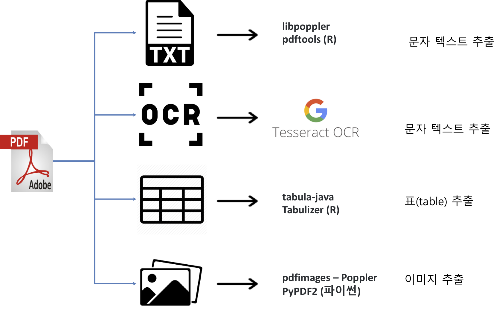

```{r, include=FALSE}
knitr::opts_chunk$set(echo = TRUE, warning=FALSE, message=FALSE,
                    comment="", digits = 3, tidy = FALSE, prompt = FALSE, fig.align = 'center')

library(tidyverse)
```


# R마크다운 내장 방법 [^pdf-embedding-method] {#embed-pdf}

[^pdf-embedding-method]: [Tidyverse 딥러닝, "캡챠 회전목마(carousel, merry-go-round): `slickR`"](https://statkclee.github.io/deep-learning/r-captcha-carousel.html)

PDF 파일을 PDF 파일 그래도 내장하는 방법과 PDF 파일을 이미지로 파일로 변환시킨 후에 이를 `slickR` 팩키지를 활용하여 회전목마 방식으로 R마크다운에 내장하는 두가지 방식이 있다.

## PDF 뷰어 파일 {#embed-pdf-viewer}

`knitr` 팩키지 `include_graphics()` 함수를 사용해서 R 코드 덩어리(chunk) 크기 등 매개변수를 조정해서 PDF 파일 자체를 내장시키는 것도 가능하다.

<pre><code>```{r embed-pdf, out.height = "460px", out.width='800px', echo=TRUE}
knitr::include_graphics("data/transparency-report-2018.pdf")
<!-- ```</code></pre> -->


```{r embed-pdf, out.height = "460px", out.width='800px', echo=FALSE}
knitr::include_graphics("data/transparency-report-2018.pdf")
```


## `slickR` 회전목마 {#embed-slickR}

또 다른 방식은 `slickR` 팩키지를 활용하여 회전목마 방식으로 [slickR with PDFs](https://yonicd.github.io/slickR/articles/pdfs.html) 사례를 참조하여 R마크다운에 내장하여 표현하는 방식이다.

```{r slickR-pdf-convert}
library(slickR)
library(pdftools)

kpmg_pdf <- pdf_convert("data/transparency-report-2018.pdf", 
                        format = 'png', 
                        verbose = FALSE,
                        pages = 1:10)
```

작업 디렉토리에 PDF 파일 각 페이지를 `transparency-report-2018_*.png` 파일명을 갖는 PNG파일로 변환시킨다.
그리고 PNG 파일을 `fig/` 디렉토리로 모두 이동시킨다.

```{bash move-transparency-files}
mv transparency*.png fig/
```

데이터프레임을 만들어 `slickR`로 각 PNG 파일을 회전목마 형태로 변환시킨다.

```{r slickR-combine}
kpmg_pdf_df <- tibble(page = glue::glue("fig/{kpmg_pdf}") )

bottom_opts <- settings(arrows = TRUE,
                        slidesToShow = 3,
                        slidesToScroll = 1,
                        centerMode = TRUE, 
                        focusOnSelect = TRUE,
                        initialSlide = 0)

slickR(kpmg_pdf_df$page, height = 600) %synch% 
  (slickR(kpmg_pdf_df$page, height = 100) + bottom_opts)
```

# PDF 문서 추출 {#pdf-document}

PDF 문서에서 원하는 데이터를 추출하는 방법은 다양한다. 먼저 PDF 파일에서 추출할 수 있는 데이터에 대해서 알아보자. 
PDF 파일에서 추출할 수 있는 데이터는 크게 4가지 방식으로 나눌 수 있다.

1. PDF 파일에서 텍스트
1. PDF 이미지에서 텍스트 추출
1. 테이블 표 추출
1. 이미지 추출 [^python-pdf]

[^python-pdf]: [stackoverflow, "Extract images from PDF without resampling, in python?"](https://stackoverflow.com/questions/2693820/extract-images-from-pdf-without-resampling-in-python)



R 팩키지 [`pdftools`](https://cran.r-project.org/web/packages/pdftools/index.html)를 활용하여 상당부분 작업을 할 수 있지만, 
표를 추출할 경우 자바 기반의 `tabulizer` 팩키지, 이미지를 추출할 경우 리눅스 poppler 구성원인 `pdfimages` 도구를 쉘에서 실행시켜 구현한다.

# PDF 일부 영역 추출 {#pdf-document-area}

PDF 파일이 텍스트, 이미지, 표 등으로 구분되어 있을 경우 이를 파이썬 [Open CV](https://pypi.org/project/opencv-python/) 등 도구를 사용해서 이미지 PDF에서 특정 객체를 인식하여 추출한 후 이를 OCR 엔진에 넣어 표에 담긴 정보를 추출한다.
