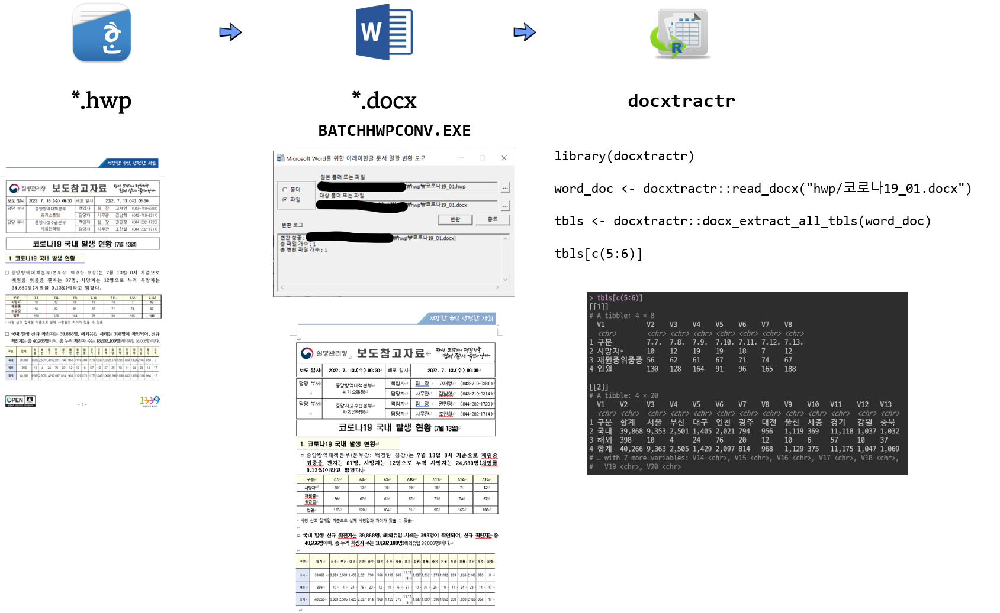
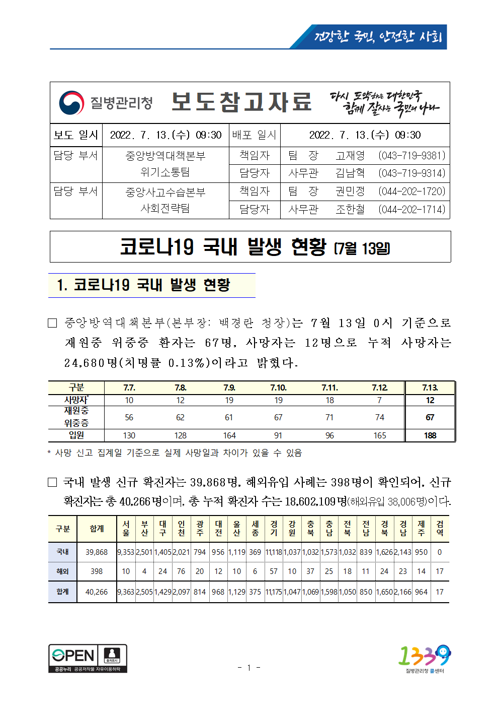

```{r, include=FALSE}
knitr::opts_chunk$set(echo = TRUE, warning=FALSE, message=FALSE,
                    comment="", digits = 3, tidy = FALSE, prompt = FALSE, fig.align = 'center')

library(tidyverse)
```



# HWP 파일

[코로나19 국내 발생 현황 (7.13.)](http://ncov.mohw.go.kr/tcmBoardView.do?brdId=3&brdGubun=31&dataGubun=&ncvContSeq=6753&board_id=312&contSeq=6753) 데이터를 HWP 파일로 제공하는 사례를 바탕으로 살펴보자.




# HWP 파일에서 표추출

```{r hwp2tbl}
library(docxtractr)
library(tidyverse)

word_doc <- docxtractr::read_docx("data/hwp/코로나19_01.docx")

tbls <- docxtractr::docx_extract_all_tbls(word_doc)

tbls[c(5:6)]
```


```{r}
tbl_colname <- tbls[[6]] %>% slice(1) %>% 
  unlist() %>% as.character(.)

tbls[[6]] %>% 
  set_names( tbl_colname ) %>% 
  slice(2:n()) %>% 
  pivot_longer(합계:검역, names_to = "시도", values_to = "확진자수") %>% 
  knitr::kable()
```


