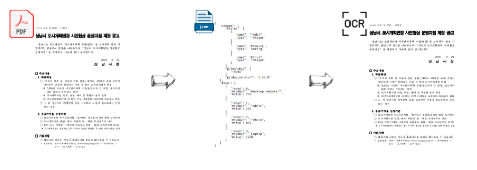

```{r, include=FALSE}
knitr::opts_chunk$set(echo = TRUE, warning=FALSE, message=FALSE,
                    comment="", digits = 3, tidy = FALSE, prompt = FALSE, fig.align = 'center')

library(tidyverse)
```




# PDF 원문 데이터 {#pdf-raw-data}

기계판독 가능한 원문 PDF 파일을 다운로드 받아 OCR Annotation 라벨 데이터로 준비한다.

``` {r raw-pdf, out.height = "460px", out.width='800px', echo=TRUE}

knitr::include_graphics("data/공고문.pdf")

```

# PDF 파일 &rarr; 이미지 {#pdf-to-image}

PDF 파일을 이미지로 변환시켜 특정된 텍스트 위치를 Bounding Box 로 표시하도록 준비한다.

``` {r pdf-to-image}
library(magick)

smpl_img <- image_read_pdf("data/공고문.pdf")
smpl_img %>% 
  image_resize("20%")
```


# PDF 파일 &rarr; 텍스트 {#pdf-text}

기계판독 가능한 PDF 파일을 `pdftools`를 사용해서 단어 위치를 Bounding Box 정보와 함께 추출한다.

``` {r pdf-to-text}
library(tidyverse)
library(pdftools)

smpl_dat <- pdftools::pdf_data("data/공고문.pdf")

smpl_tbl <- smpl_dat %>% 
  .[[1]]

smpl_tbl
```

# 텍스트 Annotation {#pdf-text-annotation}


``` {r pdf-to-text-annotation}
smpl_draw_img <- image_draw(smpl_img) 

# smpl_tbl <- smpl_tbl %>% 
#   mutate(x = round(x * 10),        #reduce resolution to minimise inconsistent coordinates
#          y = round(y * 10)) %>% 
#   arrange(y, x) %>%                        #sort in reading order
#   mutate(group = cumsum(!lag(space, default = 0)))

rect(xleft   = smpl_tbl$x, 
     ybottom = smpl_tbl$y + smpl_tbl$height, 
     xright  = smpl_tbl$x + smpl_tbl$width, 
     ytop    = smpl_tbl$y, 
     border = "blue", lty = "solid", lwd = 3)

# rect(smpl_tbl$x + smpl_tbl$width, 
#      smpl_tbl$y + smpl_tbl$height,
#      smpl_tbl$x,
#      smpl_tbl$y, 
#      border = "green", lty = "solid", lwd = 3)

print(smpl_draw_img)
```

