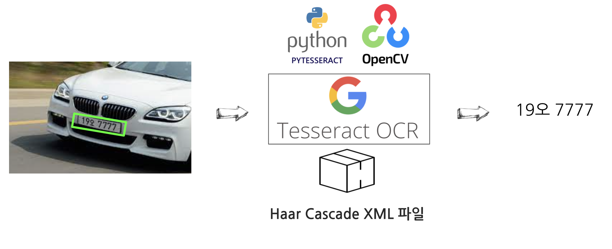

```{r, include=FALSE}
knitr::opts_chunk$set(echo = TRUE, warning=FALSE, message=FALSE,
                    comment="", digits = 3, tidy = FALSE, prompt = FALSE, fig.align = 'center')

library(tidyverse)
library(reticulate)
```



# 자동차 번호판 인식 [^1] {#pdf-car-plate-number .unnumbered}

[^1]: [Kenneth Leung (2020-12-28), "Russian Car Plate Detection with OpenCV and TesseractOCR Detect, recognize and extract car license plate numbers with the power of computer vision (A step by step tutorial)", Towards Data Science](https://towardsdatascience.com/russian-car-plate-detection-with-opencv-and-tesseractocr-dce3d3f9ff5c#4a7f)

자동차판 번호인식은 이전 OCR 문제와는 달리 자동차 번호판을 인식할 수 있는 모델(Haar Cascade feature set, XML 파일)을 다른 팩키지 사용하는 것과 비슷한 방식으로 사용한다. `haarcascade_russian_plate_number.xml` 파일을 [XML 파일](https://raw.githubusercontent.com/opencv/opencv/master/data/haarcascades/haarcascade_russian_plate_number.xml) 다운로드 한다.

# 의존 모듈 설치 {#car-plate-module}

먼저 차량 번호판 인식에 필요한 모듈을 설치한다. `pytesseract` 에서는 쉘로 `tesseract`를 호출해서 OCR 작업을 수행하기 때문에 `tesseract`를 설치하고 `pytesseract`에서 불러와서 사용하도록 설정작업을 한다. 번호판 인식을 위해서 앞서 다운로드 받은 Haar Cascade feature set, XML 파일을 지정한다.

```{python car-plate}
# 관련 작업 모듈 불러오기 ---------------
import cv2
import pytesseract
import matplotlib.pyplot as plt


# Tesseract 설정 ------------------------
pytesseract.pytesseract.tesseract_cmd = r"/usr/local/bin/tesseract"

# 번호판 인식 모듈 -----------------------
carplate_haar_cascade = cv2.CascadeClassifier('data/haarcascade_russian_plate_number.xml')
```

# 차량 이미지 {#car-plate-image}

OpenCV를 통해 자동차 이미지를 확인해보자.

```{python car-plate-target}
# 차량 번호판 인식 ------------------
carplate_img = cv2.imread('fig/ocr-bmw-car-plate.jpg')
carplate_img_rgb = cv2.cvtColor(carplate_img, cv2.COLOR_BGR2RGB)
plt.imshow(carplate_img_rgb)
```

# 번호판 인식 {#car-plate-image-start}

## 첫 시도 {#car-plate-image-first}

원본 이미지를 그대로 Haar Cascade feature set에 넣어 번호판을 제대로 인식하는지 확인하자. 자동차 번호판이 삐뚤어져 있어 엉뚱한 영역을 차량 번호판으로 인식한 것을 확인할 수 있다.

```{python car-plate-first}
# 차량 번호판 인식 함수 -----------------

def carplate_detect(image):
  carplate_overlay = image.copy() 
  carplate_rects = carplate_haar_cascade.detectMultiScale(carplate_overlay, scaleFactor=1.1, minNeighbors=3)
  
  for x,y,w,h in carplate_rects: 
      cv2.rectangle(carplate_overlay, (x,y), (x+w,y+h), (255,0,0), 5) 
      
  return carplate_overlay
  
detected_carplate_img = carplate_detect(carplate_img_rgb)
plt.imshow(detected_carplate_img)  
```

## 이미지 전처리 {#car-plate-image-preprocessing}

다양한 전처리 작업이 있지만, 먼저 자동차 이미지를 적절한 각도 15도 회전하여 차량 번호표 인식기에 넘겨 제대로 번호표를 추출했는지 시각적으로 확인해보자.

```{python car-plate-preprocessing}
# 차량 이미지 회전 후 번호판 인식 ---------------------

height, width, channel = carplate_img_rgb.shape
matrix = cv2.getRotationMatrix2D((width/2, height/2), 15, 1)
carplate_rotated_rgb = cv2.warpAffine(carplate_img_rgb, matrix, (width, height))


carplate_rotated_rgb = carplate_detect(carplate_rotated_rgb)

plt.imshow(carplate_rotated_rgb)  
```

## OCR 작업 {#car-plate-image-OCR}

`OCR` 본 작업수행을 위해서 추출된 이미지를 그레이(회색) 이미지로 변환시키고 나서 텍스트 추출작업을 수행한다.

```{python car-plate-OCR}
# 번호판 추출 -----------------------------------------

def carplate_extract(image):
    
  carplate_rects = carplate_haar_cascade.detectMultiScale(image,scaleFactor=1.1, minNeighbors=5)

  for x,y,w,h in carplate_rects: 
      carplate_img = image[y+15:y+h-10 ,x+55:x+w-7]
      
  return carplate_img

carplate_extract_img = carplate_extract(carplate_rotated_rgb)

# OCR 이미지 전처리 작업 -----------------------------

carplate_extract_img_gray = cv2.cvtColor(carplate_extract_img, cv2.COLOR_RGB2GRAY)
# carplate_extract_img_gray_blur = cv2.medianBlur(carplate_extract_img_gray, 3) 
plt.axis('off') 
plt.imshow(carplate_extract_img_gray, cmap = 'gray');
```

이제 tesseract를 호출해서 이미지 속에 담긴 번호판을 추출한다. 깔끔한 OCR 결과 추출을 위해서 `tessedit_char_whitelist`에 인식할 대상 문자를 미리 지정한다.

```{python car-plate-OCR-finally}
# OCR 작업 -------------------------------------------

car_plate_text = pytesseract.image_to_string(carplate_extract_img_gray, lang='kor', 
                            config = f'--psm 8 --oem 3 -c tessedit_char_whitelist=오ABCDEFGHIJKLMNOPQRSTUVWXYZ0123456789')

car_plate_text
```

# 마지막 작업 {#last-work}

사진속 이미지에서 번호판이 위치한 곳의 좌표를 특정하여 리스트 객체로 저장한다.

```{python exgtract-coordinate}
def carplate_coordinate(image):
    
  carplate_rects = carplate_haar_cascade.detectMultiScale(image,scaleFactor=1.1, minNeighbors=5)

  for x,y,w,h in carplate_rects: 
    carplate_coord = [x, y, w, h]
      
  return carplate_coord

carplate_coord = carplate_coordinate(carplate_rotated_rgb)
carplate_coord
```

상기 좌표를 반영하여 사진 속 이미지 위에 번호판 위치와 인식된 글씨를 동시에 표식한다. `magick` 팩키지를 사용해서 파이썬에서 인식한 OCR 객체를 다시 이미지 위에 표식한다.

```{r overlay-image}
library(tidyverse)
library(magick)

car_image <- image_read("fig/ocr-car-plate.jpeg")

# Not working ----------------------------------
# carplate_position <- glue::glue("{py$carplate_coord[[3]]} x {py$carplate_coord[[4]]} + {py$carplate_coord[[1]]} + {py$carplate_coord[[2]]}")
# 
# car_image %>% 
#   image_crop(geometry = carplate_position)

library(extrafont)
loadfonts()

car_image %>% 
  image_annotate(text     = py$car_plate_text %>% str_extract(., pattern = "[가-힣0-9]+"), 
                 location = "+100+15",
                 degrees  = 10,
                 color    = "red",
                 size     = 20,
                 font     = "NanumBarunGothic")
```
