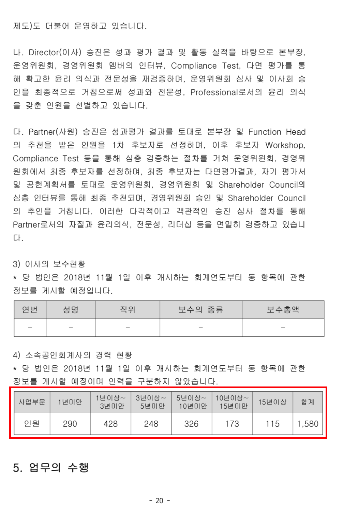
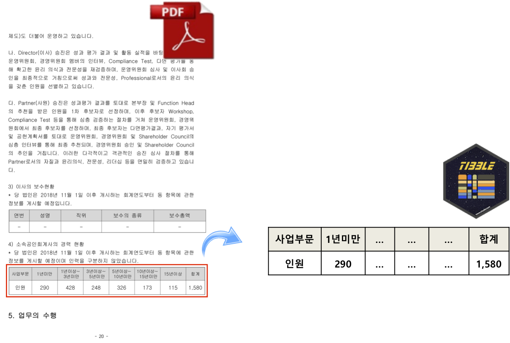

```{r, include=FALSE}
knitr::opts_chunk$set(echo = TRUE, warning=FALSE, message=FALSE,
                    comment="", digits = 3, tidy = FALSE, prompt = FALSE, fig.align = 'center')

library(tidyverse)
```

# 문제 개요 {#pdf-extract-table}

PDF 파일에서 표를 추출하는 문제를 가정해보자. [KPMG FY2018 투명성 보고서](https://assets.kpmg/content/dam/kpmg/kr/pdf/2019/transparency-report-2018.pdf)에서 20 페이지에 위치한 "소속공인회계사의 경력 현황" 표를 추출하는 경우가 이에 해당된다.

<center>
{#id .class width="55%"}
</center>

# PDF 파일에서 영역 특정 {#pdf-locate-table}

가장 먼저 해야되는 문제는 PDF 파일에서 표가 들어 있는 영역을 특정하는 것이다.

{#id .class width="100%"}

# 표 추출 방법 {#extract-tables-method}

표를 추출하여 데이터프레임으로 만드는 방법은 `tabulizer` 팩키지에서 표를 추출하는 방식과 `pdftools` 팩키지에서 텍스트를 추출하여 표를 복원하는 방식이 있다.

## `tabulizer` 표추출 {#extract-table-with-tabulizer}

`tabulizer` 팩키지를 사용하여 `locate_area()` 함수로 추출할 표의 위치를 특정한다. 
그리고 나서, `extract_tables()` 함수로 표를 데이터프레임으로 추출하고 후처리 작업을 하여 원하는 결과를 만들어낸다. 

```{r extract-tables-with-tabulizer}
library(tidyverse)
library(tabulizer)

# locate_areas(file = "data/transparency-report-2018.pdf", pages = 21)
# [[1]]
#      top     left   bottom    right 
# 630.8387  81.0575 703.5307 539.9231 

kpmg_table <- extract_tables("data/transparency-report-2018.pdf", 
                             pages = 21,
                             encoding = "UTF-8",
                             output = "data.frame",
                             method = "stream",
                             guess = TRUE,
                             area = list(c(630.8387,  81.0575, 703.5307, 539.9231)))

## 표 후처리 작업
var_name <- c("사업부문", "1년미만", "1년이상~3년미만", "3년이상~5년미만", "5년이상~10년미만", "10년이상~15년미만", "15년이상", "합계")

kpmg_table %>% 
  .[[1]] %>% 
  janitor::clean_names()  %>% 
  set_names(var_name) %>% 
  slice(3) %>% 
  pivot_longer(`사업부문`:`합계`, names_to ="구분", values_to="인원") %>% 
  filter(구분 != "사업부문")

```

## 표위치 특정 - `pdf_data()` {#transparency-pdf}

[KPMG FY2018 투명성 보고서](https://assets.kpmg/content/dam/kpmg/kr/pdf/2019/transparency-report-2018.pdf)에서 20 페이지에 위치한 "소속공인회계사의 경력 현황" 표를 특정하기 위해서 먼저 경로명을 입력한다.
`pdf_data()` 함수를 사용해서 해당 표에 해당되는 모든 텍스트를 가져온다.

```{r extract-table-from-pdf}
library(pdftools)
library(tidyverse)

transprency_pdf <- "data/transparency-report-2018.pdf"

# pdf_info(transprency_pdf)
# pdf_fonts(transprency_pdf)

(transparency_tbl <- pdf_data(transprency_pdf)[[21]] %>% 
  filter(x > 90, x< 502, y>635, y<676 ))
```

# 위치 DF &rarr; 표 DF {#transparency-pdf-to-table}

앞서 추출한 위치를 포함한 데이터프레임을 표 데이터프레임으로 변환시킨다.

```{r extract-table-from-pdf-to-table}
(transparency_tmp_tbl <- transparency_tbl %>% 
  mutate(clean_text = case_when(str_detect(text, "사업부문") ~ "사업부문",
                                str_detect(text, "1년미만") ~ "1년미만",
                                str_detect(text, "1년이상") ~ "1년이상~3년미만",
                                str_detect(text, "3년이상") ~ "3년이상~5년미만",
                                str_detect(text, "\\b5년이상\\b") ~ "5년이상~10년미만",
                                str_detect(text, "10년이상") ~ "10년이상~15년미만",
                                str_detect(text, "\\b15년이상\\b") ~ "15년이상",
                                str_detect(text, "인원") ~"인원",
                                str_detect(text, "\\d{3}") ~ text,
                                TRUE ~ "기타")) %>% 
  filter(!str_detect(clean_text, "기타|,")) %>% 
  mutate(fieldname_value = case_when(str_detect(clean_text, "\\d{3}|\\b인원\\b") ~ "value",
                                     TRUE ~ "field")) %>% 
  select(fieldname_value, clean_text))

## 필드명과 값 결합
transparency_field_tbl <- transparency_tmp_tbl %>% 
  filter(fieldname_value == "field",
         !str_detect(clean_text, "사업부문")) %>% 
  select(사업구분 = clean_text)

transparency_value_tbl <- transparency_tmp_tbl %>% 
  filter(fieldname_value == "value",
        !str_detect(clean_text, "인원")) %>% 
  select(인원 = clean_text)
  
transparency_df <- 
  bind_cols(transparency_field_tbl, transparency_value_tbl) 

transparency_df %>% 
  DT::datatable()
```

# 분석가능한 데이터프레임 {#transparency-pdf-to-table-schema}

다음 단계로 시각화 및 각종 통계분석을 위해서 자료형을 적절히 맞춘다. 즉, 사업구분은 범주형으로 범주수준도 유의미하게 맞추고, 인원수도 숫자로 인식시킨다. 이를 바탕으로 `ggplot` 으로 시각화 한다.

```{r extract-table-from-pdf-to-table-schema}
transparency_df %>% 
  mutate(인원 = parse_number(인원)) %>% 
  mutate(사업구분 = factor(사업구분, levels = c("1년미만", "1년이상~3년미만", "3년이상~5년미만", 
                                                 "5년이상~10년미만", "10년이상~15년미만", "15년이상")))  %>% 
  ggplot(aes(x=fct_rev(사업구분), y=인원)) +
    geom_col(fill="skyblue") +
    coord_flip() +
    theme_bw(base_family = "AppleGothic") +
    labs(x="", y="", title="KPMG 공인회계사 경력현황")
```

# 데이터프레임 정답비교 {#transparency-table-comparison}

Paul Murrell의 [`compare`](https://cran.r-project.org/web/packages/compare/index.html), [`compareDF`](https://github.com/alexsanjoseph/compareDF), 자바스크립트 기반 [`daff`](https://github.com/edwindj/daff) 팩키지가 데이터프레임 비교 전용으로 알려져 있고, 그외에도 `dplyr::setdiff` 혹은 `sqldf` 팩키지 SQL, `merge` 함수를 사용하는 다양한 사례가 있다.

```{r extract-table-comparison}
library(compare)

## PDF 파일에서 추출한 표
transparency_df <- transparency_df %>% 
  mutate(인원 = parse_number(인원))

## 정답표
solution_df <- tribble(~"사업구분", ~"인원",
"1년미만", 290,
"1년이상~3년미만", 428,
"3년이상~5년미만", 248,
"5년이상~10년미만", 326,
"10년이상~15년미만", 173,
"15년이상", 115)

## 정답표와 추출한 PDF 비교

# check_answer_df <- compare_df(transparency_df, solution_df, c("사업구분", "인원"))
compare(transparency_df, solution_df)
```


