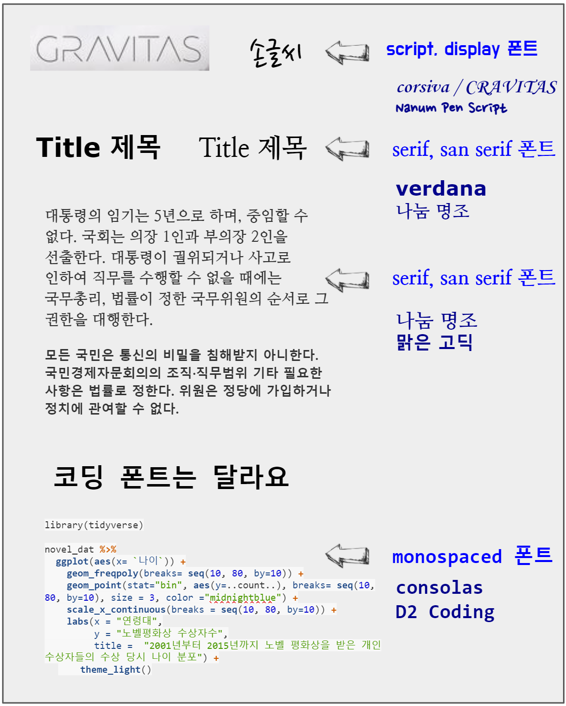
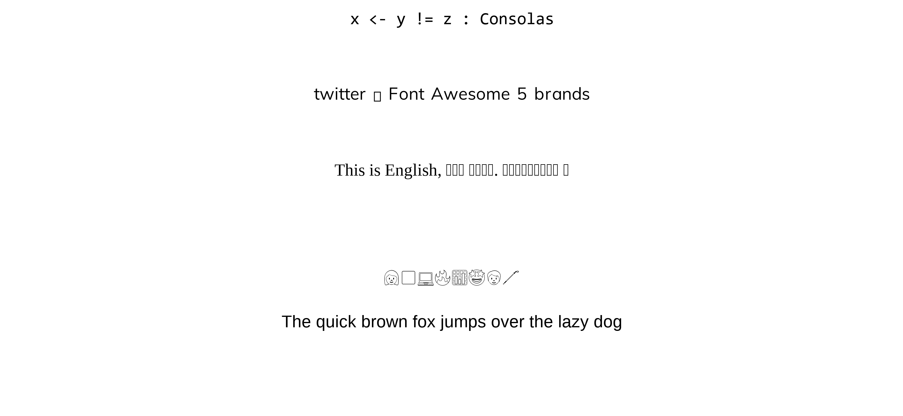
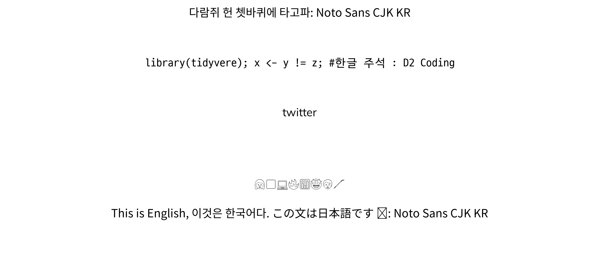

```{r setup, include=FALSE}
knitr::opts_chunk$set(echo = TRUE, message=FALSE, warning=FALSE,
                      comment="", digits = 3, tidy = FALSE, prompt = FALSE, fig.align = 'center')

```

<iframe width="560" height="315" src="https://www.youtube.com/embed/TBs1abqWpY4" frameborder="0" allow="accelerometer; autoplay; clipboard-write; encrypted-media; gyroscope; picture-in-picture" allowfullscreen>

</iframe>

# 글꼴 분류 [^1] {#font-classification}

[^1]: [Adobe Korea (August 21, 2017), "글꼴의 기능과 디자인에 적합한 글꼴 선택 방법"](https://blog.adobe.com/ko/publish/2017/08/21/whats-in-a-fonts-can-define-your-design.html#gs.u0he6a)

-   **활자(Type)**는 본래는 글자를 만드는 데 사용된 나무 또는 금속 조각을 일컫는 말이었습니다.
-   **타이포그래피(Typography)**: 인쇄된 텍스트의 스타일과 모양을 가리키는 디자인 용어입니다.
-   **서체(또는 글꼴 모음, Typeface)**: 글자 및 기호가 서로 비슷한 특징을 가지도록 디자인된 문자fh 타임즈(Times), 에어리얼(Arial) 및 미니언(Minion)을 들 수 있습니다.
-   **글꼴(Font)**: 서체의 특정 스타일을 지칭하는데, 예를 들어, 에어리얼 블랙(Arial Black)은 에어리얼 서체 중 한 글꼴이며, 미니언 프로 이탤릭체(Minion Pro Italic)는 미니언 글꼴 모음에 포함되어 있는 글꼴이다.

글꼴(Font)는 다양하지만 크게 다음 5가지로 영문의 경우 분류된다. 글꼴은 기본적으로 **세리프(serif)**와 **산세리프(sans serif)**의 2가지 스타일로 구분되는데 세리프는 글자의 획 끝에 작은 삐침이 있는 글꼴이며 산스(sans)은 라틴어로 없다는 뜻이기 때문에 삐침이 없는 글꼴을 지칭합니다.

-   serif
-   sans serif
-   script
-   monospaced
-   display

가장 쉽게 분류되는 `monospaced` 글꼴은 코드를 작성하기 위해 등간격을 갖는 글꼴로 `consolas`, `D2 Coding`이 대표적이다. 산세리프(Sans serif)와 세리프(Serif) 글꼴은 본문에 사용하기 적합하지만, 좀더 시선을 끄는 디자인을 위해서는 조금 더 매력적인 **디스플레이(Display)** 혹은 **스크립트(Script)**을 선택하고, 제목(Title)에는 산세리프 글꼴을 사용하는 것이 일반적이다.



## `typeface` vs `font` {#typeface-vs-font}

`typeface`는 서체로 번역되고 `font`는 글꼴로 번역된다. 하나의 `typeface`에 다수 `font`가 포함될 수 있다. [**팬그램(Pangram)**](https://ko.wikipedia.org/wiki/팬그램)은 '모든 글자'라는 뜻으로 주어진 모든 문자를 적어도 한 번 이상 사용하여 만든 문장을 뜻한다. 팬그램은 로렘 입숨처럼 글꼴 샘플을 보여주거나 장비를 테스트하는 데 사용된다. 영어 팬그램으로 가장 유명한 'The quick brown fox jumps over the lazy dog'는 19세기부터 사용되어 왔다.

## 문서 - R 마크다운 {#typeface-vs-font-rmarkdown}

아래 서체(typeface, font family)는 `Noto Sans CJK KR`이나 글꼴(font)은 크기, 굵기, 스타일에 따라 다양하게 텍스트를 표현할 수 있다.

::: {.row}
::: {.col-md-6}
**서체(typeface, `Noto Sans CJK KR`)**

<p style="font-family: Noto Sans CJK KR; font-size:17pt; font-weight:medium">

다람쥐 헌 쳇바퀴에 타고파

</p>
:::

::: {.col-md-6}
**글꼴(font)**

<p style="font-family: Noto Sans CJK KR; font-size:17pt; font-weight:100">

다람쥐 헌 쳇바퀴에 타고파

</p>

<p style="font-family: Noto Sans CJK KR; font-size:17pt; font-style:italic, font-weight:200">

다람쥐 헌 쳇바퀴에 타고파

</p>

<p style="font-family: Noto Sans CJK KR; font-size:17pt; font-weight:300">

다람쥐 헌 쳇바퀴에 타고파

</p>

```{=html}
<p style="font-family: Noto Sans CJK KR; font-size:17pt; font-style:italic>
다람쥐 헌 쳇바퀴에 타고파
</p>

<p style="font-family: Noto Sans CJK KR; font-size:17pt; font-weight:500">
다람쥐 헌 쳇바퀴에 타고파
</p>
```
<p style="font-family: Noto Sans CJK KR; font-size:17pt; font-weight:700">

다람쥐 헌 쳇바퀴에 타고파

</p>

<p style="font-family: Noto Sans CJK KR; font-size:17pt; font-weight:900">

다람쥐 헌 쳇바퀴에 타고파

</p>
:::
:::

R마크다운에서 다양한 서체를 글꼴을 달리하여 표현하는 방식은 `css`를 해당 텍스트에 다음과 같이 적용하는 것이다.

```{r css-typeface, eval = FALSE}
<p style="font-family: Noto Sans CJK KR; font-size:17pt; font-style:italic, font-weight:200">
다람쥐 헌 쳇바퀴에 타고파
</p>

```

# 글꼴 출력 [^2] {#print-fonts}

[^2]: [Cookbook for R \>\> Graphs \>\> Fonts](http://www.cookbook-r.com/Graphs/Fonts/)

`fontface`에 대한 감을 갖기 위해 대표 글꼴을 `ggplot`으로 화면에 찍어본다.

```{r print-fonts}
library(tidyverse)

fonttable <- tribble(~"Short", ~"Canonical",
                         "mono", "Courier",
                         "sans", "Helvetica",
                         "serif", "Times",
                         "", "AvantGarde",
                         "", "Bookman",
                         "", "Helvetica-Narrow",
                         "", "NewCenturySchoolbook",
                         "", "Palatino",
                         "", "URWGothic",
                         "", "URWBookman",
                         "", "NimbusMon",
                         "URWHelvetica", "NimbusSan",
                         "", "NimbusSanCond",
                         "", "CenturySch",
                         "", "URWPalladio",
                         "URWTimes", "NimbusRom")

fonttable <- fonttable %>% 
  mutate(pos = row_number())

fonttable_tbl <- fonttable %>% 
  pivot_longer(cols = c(Short, Canonical), names_to = "NameType", values_to = "Font")

# Face table
facetable <- tibble ("Face" = c("plain","bold","italic","bold.italic")) %>% 
  mutate(Face = factor(Face, levels = c("plain","bold","italic","bold.italic")))

fullfonts <- merge(fonttable_tbl, facetable)

fullfonts %>% 
  ggplot(aes(x=NameType, y=pos)) +
    geom_text(aes(label=Font, family=Font, fontface=Face)) +
  facet_wrap(~ Face, ncol=2)
```

# R 글꼴 {#r-device}

`ggplot`에 텍스트를 화면에 표현하는 그래픽 장치(Graphics Device, GD)는 5가지가 존재한다.

-   `png()`
-   `pdf()`
-   스크린 화면 : Windows
-   스크린 화면 : Mac
-   스크린 화면 : Linux

5가지 그래픽 장치는 서로 달라 정확한 텍스트를 화면이나 `png`, `pdf` 파일이나 이미지에 넣는 것은 쉽지 않지만, 다음 팩키지가 그 역할을 수행하고 있다.

-   `showtext`
-   `extrafont`
-   `systemfonts`

# `font` 문제지 {#font-playground-problem}

`ggplot` 그래프에 담아내야 하는 글꼴은 다양한 것이 포함된다. 코드에 대한 글꼴(`consolas`, `D2 Coding` 등), 이모지 글꼴, 한글/영문 글꼴 등 다양한다.

## 환경설정 {#english-test-environment}

로고, 이모지, 코딩에 해당되는 글꼴을 R에서 불러와서 사용할 수 있도록 준비한다. `.ttf` 트루타입 폰트 대신 `.otf` 폰트를 설치할 수 있는 `showtext` 팩키지를 폰트 관리자(?)로 사용한다.

```{r fonttype-face-logo, dev="ragg_png"}
library(tidyverse)
library(ragg)
library(systemfonts)
library(showtext)

## 로고 
font_add("Font Awesome 5 brands",
         regular = "Font Awesome 5 Free-Regular-400.otf")

## 코딩 - Consolas, D2 Coding
font_add("Consolas",
         regular    = "consola.ttf",
         bold       = "consolab.ttf",
         italic     = "consolai.ttf",
         bolditalic = "consolaz.ttf")

font_add("D2 Coding",
         regular    = "D2Coding-Ver1.3.2-20180524.ttf",
         bold       = "D2CodingBold-Ver1.3.2-20180524.ttf")

## 이모지 폰트
font_add("Twitter Color Emoji",
         regular    = "TwitterColorEmoji-SVGinOT.ttf")
# font_add("Noto Color Emoji",
#          regular    = "NotoColorEmoji.ttf")

font_families()
```

## 영문 테스트 {#english-test}

"The quick brown fox jumps over the lazy dog" 영문 텍스트와 관련하여 영어로 생길 수 있는 다양한 사례를 바탕으로 글꼴을 `ggplot`에 찍어보자.

```{r fonttype-face, dev="ragg_png", eval = FALSE}
## 예제 텍스트 

code <- "x <- y != z : Consolas"
logo <- "twitter : Font Awesome 5 brands"
fallback_text <- "This is English, 이것은 한국어다. この文は日本語です 🚀"
emojis <- "👩🏾💻🔥📊🤩🧑🦯"
english_text <- "The quick brown fox jumps over the lazy dog"


eng_p <- ggplot() + 
  geom_text(
    aes(x = 0, y = 5, label = code), 
    family = "Consolas", size = 15
  ) + 
  geom_text(
    aes(x = 0, y = 4, label = logo), 
    family = "Font Awesome 5 brands", size = 15
  ) + 
  geom_text(
    aes(x = 0, y = 3, label = fallback_text), 
    family = "serif", size = 15
  ) + 
  geom_text(
    aes(x = 0, y = 2, label = emojis), 
    family = "Twitter Color Emoji", size = 15
  ) + 
  geom_text(
    aes(x = 0, y = 1, label = english_text), 
    family = "sans", size = 15
  ) + 
  expand_limits(y = c(0, 5)) +
  theme_void()

eng_p %>% 
  ggsave(filename = "fig/ggplot-tyopgraphy-eng.png")

```



## 한글 테스트 {#korean-test}

```{r fonttype-face-korean, dev="ragg_png", eval = FALSE}
## 예제 텍스트 
korean_text <- "다람쥐 헌 쳇바퀴에 타고파: Noto Sans CJK KR"
korean_code <- "library(tidyvere); x <- y != z; #한글 주석 : D2 Coding"
logo <- "twitter"
emojis <- "👩🏾💻🔥📊🤩🧑🦯"
fallback_text <- "This is English, 이것은 한국어다. この文は日本語です 🚀: Noto Sans CJK KR"

# 시각화
kor_p <- ggplot() + 
  geom_text(
    aes(x = 0, y = 5, label = korean_text), 
    family = "Noto Sans CJK KR", size = 15
  ) + 
  geom_text(
    aes(x = 0, y = 4, label = korean_code), 
    family = "D2 Coding", size = 15
  ) + 
  geom_text(
    aes(x = 0, y = 3, label = logo), 
    family = "Font Awesome 5 brands", size = 15
  ) + 
  geom_text(
    aes(x = 0, y = 2, label = emojis), 
    family = "Twitter Color Emoji", size = 15
  ) + 
  geom_text(
    aes(x = 0, y = 1, label = fallback_text), 
    family = "Noto Sans CJK KR", size = 15
  ) + 
  expand_limits(y = c(0, 5)) +
  theme_void()

kor_p %>% 
  ggsave(filename = "fig/ggplot-tyopgraphy.png")
```


