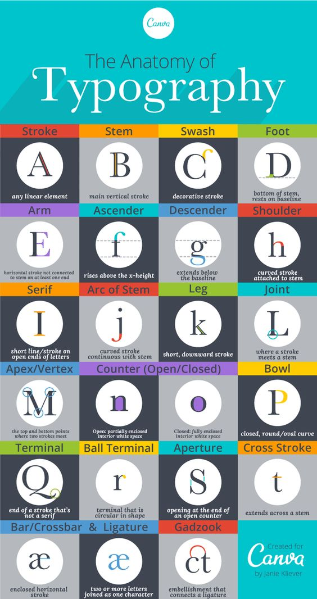
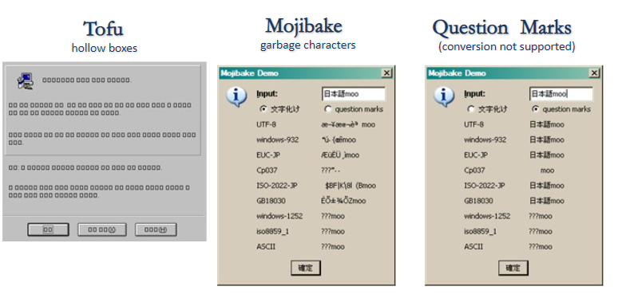

```{r setup, include=FALSE}
knitr::opts_chunk$set(echo = TRUE, message=FALSE, warning=FALSE,
                      comment="", digits = 3, tidy = FALSE, prompt = FALSE, fig.align = 'center')

```



# 주요 용어 정리 [^1] {#glossary}

[^1]: [이경 (2012년 12월 03일), "타이포그래피 겉핥기", spoqa 기술블로그](https://spoqa.github.io/2012/12/03/Typography.html)

-   `typography`: 타이포그래피(Typography)는 활자 서체의 배열을 말하는데, 활자의 서체나 글자 배치 따위를 구성하고 표현하는 일을 가리키는 용어. 활판술, 조판이라고 번역된다.

    -   '활자'를 의미하는 'Type'와 '-술'을 의미하는 접미사 'Graphy'의 합성어이다. 즉, 영어 단어 `typography`는 그리스어의 두 단어 τύπος(typos, 표시)와 γράφω(grapho, 쓰다)에서 유래된 조어이다.

-   black letter

-   폰트(font): 사전적 의미로 글자란 말을 적는 일정한 체계의 부호로 숫자와 문장부호가 포함. 영어로 letter, type, character, font가 같은 뜻을 갖고 있는데 좀더 물리적인 속성을 담고 있어 타입페이스(`typeface`)란 바로 이 금속활자의 찍히는 얼굴 면, 그 모양을 말하는 것임. 또한, 폰트(font)란 통일된 구조와 속성을 가진 한 벌의 기호나 글자를 지칭하며, 요즘은 같은 스타일을 가진 폰트 모두를 지칭할 때 같은 스타일의 폰트 묶음인 타입패밀리(type family)가 있음.

-   이음자(Ligatures): 둘 이상의 글자를 자연스럽게 결합하는 것

-   헬베티카(Helvetica) 타입 패밀리: 중량, 획 굵기에 관해서는 가느다랗고 경쾌한 라이트(light)부터 레귤러(regular), 미디엄(medium), 두껍고 무거운 볼드(bold) 등이 있고 글자 폭에 관해서는 익스펜디드(expanded), 레귤러(regular), 콘덴시드(condensed) 등이 있고, 이 변화 폭은 엑스트라 라이트, 울트라 볼드, 울트라 익스펜디드, 엑스트라 콘덴시드 등으로 더 나뉘기도 한다.

-   `typeface`:

-   `scripts`:

- `noto`: **노토(Noto)**는 유니코드 표준으로 인코딩된 모든 언어를 커버하기위한 폰트 패밀리로 구글에서 개발시작했다. 이 글꼴은 여러 언어나 문자를 전체적인 시각적 조화(예를 들면, 서로 맞는 높이와 획의 굵기 등)를 이루는 것을 목표로 Apache License 2.0로 배포된다. 컴퓨터에서 표시 못하는 문자가 있을 때 문자 대신에 조그만 사각형(□)이 표시되는 일이 많이 있는데 이를 흔히 **"두부"(tofu)**라고 부르며, 구글은 Web 상에서 이를 없애기 위해서 Noto(No Tofu) 폰트를 개발했다.

-   `unicode`: **유니코드(Unicode)**는 전 세계의 모든 문자를 컴퓨터에서 일관되게 표현하고 다룰 수 있도록 설계된 산업 표준이며, 유니코드 협회(Unicode Consortium)가 제정한다. 이 표준에는 ISO 10646 문자 집합, 문자 인코딩, 문자 정보 데이터베이스, 문자들을 다루기 위한 알고리즘 등을 포함하고 있다. 유니코드의 기원은 1987년으로 거슬러 올라가며, 이 때 제록스의 조 베커와 애플의 리 콜린스, 마크 데이비스가 통일된 문자 집합을 만드는 것을 탐구하기 시작하였다. 1988년 조 베커는 유니코드라는 이름의 국제/다언어 문자 인코딩 시스템(international/multilingual text character encoding system, tentatively called Unicode)를 위한 초안을 출판하였다.

-   `glyphs`:

-   `ascender`:

-   `descender`:

-   `tracking`:

-   `hinting`:

-   `kerning`:

-   `shaping`:

-   `weight`:

-   `slant`:

 \#\# 그래픽 장치 {\#graphics-device}

`ggplot`에 텍스트를 화면에 표현하는 그래픽 장치(Graphics Device, GD)는 5가지가 존재한다.

-   `png()`
-   `pdf()`
-   스크린 화면 : Windows
-   스크린 화면 : Mac
-   스크린 화면 : Linux

5가지 그래픽 장치는 서로 달라 정확한 텍스트를 화면이나 `png`, `pdf` 파일이나 이미지에 넣는 것은 쉽지 않지만, 다음 팩키지가 그 역할을 수행하고 있다.

-   `showtext`
-   `extrafont`
-   `systemfonts`

<p style="font-family: Nanum Pen Script; font-size:17pt; font-style:italic">

나눔고딕 폰트 테스트 중입니다.

</p>

```{r}
library(showtext)

extrafont::fonttable()$FamilyName
```

# `font` 운동장 {#font-playground}

```{r fonttype-face}
library(tidyverse)
library(ragg)
library(systemfonts)

code <- "x <- y != z"
logo <- "twitter"
fallback_text <- "This is English, 이것은 한국어다. この文は日本語です 🚀"
emojis <- "👩🏾💻🔥📊"

p <- ggplot() + 
  geom_text(
    aes(x = 0, y = 1, label = code), 
    family = "Fira Code"
  ) + 
  geom_text(
    aes(x = 0, y = 2, label = logo), 
    family = "Font Awesome 5 brands"
  ) + 
  geom_text(
    aes(x = 0, y = 3, label = fallback_text), 
    family = "Font Awesome 5 brands"
  ) + 
  geom_text(
    aes(x = 0, y = 3, label = emojis), 
    family = "Font Awesome 5 brands"
  ) + 
  expand_limits(y = c(0, 5))
p
```

# `typeface` vs `font` {#typeface-vs-font}

`typeface`는 서체로 번역되고 `font`는 글꼴로 번역된다. 하나의 `typeface`에 다수 `font`가 포함될 수 있다. [**팬그램(Pangram)**](https://ko.wikipedia.org/wiki/팬그램)은 '모든 글자'라는 뜻으로 주어진 모든 문자를 적어도 한 번 이상 사용하여 만든 문장을 뜻한다. 팬그램은 로렘 입숨처럼 글꼴 샘플을 보여주거나 장비를 테스트하는 데 사용된다. 영어 팬그램으로 가장 유명한 'The quick brown fox jumps over the lazy dog'는 19세기부터 사용되어 왔다.

## 문서 - R 마크다운 {#typeface-vs-font-rmarkdown}

아래 서체(typeface, font family)는 `Noto Sans CJK KR`이나 글꼴(font)은 크기, 굵기, 스타일에 따라 다양하게 텍스트를 표현할 수 있다.

::: {.row}
::: {.col-md-6}
**서체(typeface, `Noto Sans CJK KR`)**

<p style="font-family: Noto Sans CJK KR; font-size:17pt; font-weight:medium">

다람쥐 헌 쳇바퀴에 타고파

</p>
:::

::: {.col-md-6}
**글꼴(font)**

<p style="font-family: Noto Sans CJK KR; font-size:17pt; font-weight:100">

다람쥐 헌 쳇바퀴에 타고파

</p>

<p style="font-family: Noto Sans CJK KR; font-size:17pt; font-style:italic, font-weight:200">

다람쥐 헌 쳇바퀴에 타고파

</p>

<p style="font-family: Noto Sans CJK KR; font-size:17pt; font-weight:300">

다람쥐 헌 쳇바퀴에 타고파

</p>

```{=html}
<p style="font-family: Noto Sans CJK KR; font-size:17pt; font-style:italic>
다람쥐 헌 쳇바퀴에 타고파
</p>

<p style="font-family: Noto Sans CJK KR; font-size:17pt; font-weight:500">
다람쥐 헌 쳇바퀴에 타고파
</p>
```
<p style="font-family: Noto Sans CJK KR; font-size:17pt; font-weight:700">

다람쥐 헌 쳇바퀴에 타고파

</p>

<p style="font-family: Noto Sans CJK KR; font-size:17pt; font-weight:900">

다람쥐 헌 쳇바퀴에 타고파

</p>
:::
:::

R마크다운에서 다양한 서체를 글꼴을 달리하여 표현하는 방식은 `css`를 해당 텍스트에 다음과 같이 적용하는 것이다.

```{r css-typeface, eval = FALSE}
<p style="font-family: Noto Sans CJK KR; font-size:17pt; font-style:italic, font-weight:200">
다람쥐 헌 쳇바퀴에 타고파
</p>

```

## 그래프 - `ggplot` {#typeface-vs-font-ggplot}

```{r test-fonts}
code <- "x <- y != z"
logo <- "twitter"
fallback_text <- "This is English, 이것은 한국어다. この文は日本語です 🚀"
emojis <- "👩🏾💻🔥📊"
korean_text <- "다람쥐 헌 쳇바퀴에 타고파"
english_text <- "The quick brown fox jumps over the lazy dog"

ggplot() + 
  geom_text(
    aes(x = 0, y = 1, label = code), 
    family = "Fira Code") + 
  geom_text(
    aes(x = 0, y = 2, label = logo), 
    family = "") + 
  geom_text(
    aes(x = 0, y = 3, label = fallback_text), 
    family = "") + 
  geom_text(
    aes(x = 0, y = 4, label = emojis), 
    family = "") + 
  geom_text(
    aes(x = 0, y = 5, label = korean_text), 
    family = "NanumGothic") + 
  geom_text(
    aes(x = 0, y = 6, label = english_text), 
    family = "") + 
  expand_limits(y = c(0, 5)) +
  theme_void(base_family = 'Open Sans')
  # theme(text = element_text(family = 'Open Sans'))
```

```{r typeface-font}
ggplot() + 
  geom_text(
    aes(x = -0.1, y = 5, label = korean_text), 
    family = "NanumGothic") + 
  geom_text(
    aes(x = 0, y = 2, label = logo), 
    family = "") + 
  geom_text(
    aes(x = 0, y = 3, label = fallback_text), 
    family = "") + 
  geom_text(
    aes(x = 0, y = 4, label = emojis), 
    family = "") + 
  geom_text(
    aes(x = 0, y = 5, label = korean_text), 
    family = "NanumGothic") + 
  geom_text(
    aes(x = 0, y = 6, label = english_text), 
    family = "NanumGothic") + 
  expand_limits(y = c(0, 5)) 
```

## 설치된 글꼴 확인 {#check-fonts}

[`systemfonts`](https://github.com/r-lib/systemfonts) 팩키지를 활용하여 로컬 컴퓨터에서 설치된 글꼴을 확인할 수 있다.

```{r check-fonts}
library(systemfonts)

match_font('NanumGothic')

system_fonts() %>% 
  filter(str_detect(family, "Noto"))
```

"다람쥐 헌 쳇바퀴에 타고파" 문장을 글꼴과 굵기를 달리하여 `ggplot`에 시각화해보자.

```{r how-to-set-default-fonts}
library(extrafont)
# extrafont::font_import(pattern = "NanumBarunGothicBold",  prompt = FALSE)
# extrafont::font_import(pattern = "NanumBarunGothicLight", prompt = FALSE)
loadfonts()

ggplot() + 
  geom_text(
    aes(x = -0.1, y = 5, label = korean_text),
    family = "Noto Sans CJK KR", fontface = "plain", size = 7) + 
  geom_text(
    aes(x = -0.1, y = 4, label = korean_text),
    family = "Noto Sans CJK KR", fontface = "bold", size = 7) + 
  geom_text(
    aes(x = -0.1, y = 3, label = korean_text),
    family = "NanumGothic", fontface = 1.5, size = 7) + 
  geom_text(
    aes(x = -0.1, y = 2, label = korean_text),
    family = "NanumGothic", fontface = 2, size = 7) + 
  labs(title = korean_text) +
  expand_limits(y = c(1, 5))  +
  # theme(text = element_text(face="bold")) +
  theme_gray(base_family = "Noto Sans CJK KR")
```

# 현지화/세계화 {#localization}

현지화(Localization)은 세계화(internationalization)의 동전의 양면과 같은 것이다. 세계화를 영어로 internationalization으로 길기 때문에 i18n으로 줄여서 현지화는 영어로 Localization으로 길기 때문에 동일한 로직으로 L10N으로 줄여 표현한다. 현지화에 해당되는 사항은 다음이 포함된다.

- 문자 집합(Character Set)
- 통화(Currency)
- 날씨 온도($\degree C / \degree F$)
- 길이 (킬로미터, 마일)
- 날짜와 시간 (Date and Time)
- 키보드 배열
- 왼쪽에서 오른쪽으로 혹은 위에서 아래 혹은 우측에서 좌측으로 텍스트 작성과 문서 양식(Text Directions and Layouts)


## 인코딩 (Encoding) {#encoding-charset}

**문자 인코딩(character encoding)** 줄여서 인코딩은 사용자가 입력한 문자나 기호들을 컴퓨터가 이용할 수 있는 신호로 만드는 것을 말한다. 넓은 의미의 컴퓨터는 이러한 신호를 입력받고 처리하는 기계를 뜻하며, 신호 처리 시스템을 통해 이렇게 처리된 정보를 사용자가 이해할 수 있게 된다.

All text has a character encoding. 

When things go wrong, start by asking what the encoding is, what encoding you expected it to be, and whether the bytes match the encoding.

- Code Unit: A unit of physical storage and information interchange
- Glyph: A single shape (in text)
- Grapheme: A single visual unit of text: the smallest abstract unit of meaning in a writing system
- Character: A single logical unit of text
- Character Set: A set of characters
- Coded Character Set: A set of characters in which each character is assigned a numeric identifier.
- Character Encoding Form: Mpas code points to code units

## 인코딩 문제 [^encoding-problem] {#encoding-problem}

[^encoding-problem]: [나무위키, "문자 깨짐"](https://namu.wiki/w/%EB%AC%B8%EC%9E%90%20%EA%B9%A8%EC%A7%90)

문자 인코딩(Encoding) 관련하여 크게 3가지 흔한 문제가 있다.

- 두부(Tofu)
- 문자깨짐(Mojibake, 文字化け): 일본어에서는 문자 깨짐을 모지바케라고 부름.
- 의문부호(Question Marks)





