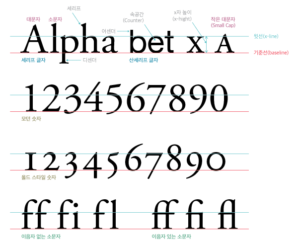

```{r setup, include=FALSE}
knitr::opts_chunk$set(echo = TRUE, message=FALSE, warning=FALSE,
                      comment="", digits = 3, tidy = FALSE, prompt = FALSE, fig.align = 'center')

```

# 주요 용어 정리 [^spoqa-typography] {#glossary}

[^spoqa-typography]: [이경 (2012년 12월 03일), "타이포그래피 겉핥기", spoqa 기술블로그](https://spoqa.github.io/2012/12/03/Typography.html)

- `typography`: 타이포그래피(Typography)는 활자 서체의 배열을 말하는데, 활자의 서체나 글자 배치 따위를 구성하고 표현하는 일을 가리키는 용어.
    - '활자'를 의미하는 'Type'와 '-술'을 의미하는 접미사 'Graphy'의 합성어이다. 즉, 영어 단어 `typography`는 그리스어의 두 단어 τύπος(typos, 표시)와 γράφω(grapho, 쓰다)에서 유래된 조어이다.
- black letter     
- 폰트(font): 사전적 의미로 글자란 말을 적는 일정한 체계의 부호로 숫자와 문장부호가 포함. 영어로 letter, type, character, font가 같은 뜻을 갖고 있는데 좀더 물리적인 속성을 담고 있어 타입페이스(`typeface`)란 바로 이 금속활자의 찍히는 얼굴 면, 그 모양을 말하는 것임. 또한, 폰트(font)란 통일된 구조와 속성을 가진 한 벌의 기호나 글자를 지칭하며, 요즘은 같은 스타일을 가진 폰트 모두를 지칭할 때 같은 스타일의 폰트 묶음인  타입패밀리(type family)가 있음.
- 이음자(Ligatures): 둘 이상의 글자를 자연스럽게 결합하는 것
- 헬베티카(Helvetica) 타입 패밀리: 중량, 획 굵기에 관해서는 가느다랗고 경쾌한 라이트(light)부터 레귤러(regular), 미디엄(medium), 두껍고 무거운 볼드(bold) 등이 있고 글자 폭에 관해서는 익스펜디드(expanded), 레귤러(regular), 콘덴시드(condensed) 등이 있고, 이 변화 폭은 엑스트라 라이트, 울트라 볼드, 울트라 익스펜디드, 엑스트라 콘덴시드 등으로 더 나뉘기도 한다.



<p style="font-family: Nanum Pen Script; font-size:17pt; font-style:italic">
    나눔고딕 폰트 테스트 중입니다.
</p>

```{r}
library(showtext)

extrafont::fonttable()$FamilyName
```


