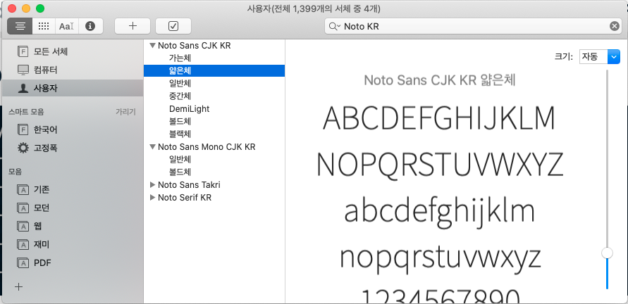

```{r setup, include=FALSE}
knitr::opts_chunk$set(echo = TRUE, message=FALSE, warning=FALSE,
                      comment="", digits = 3, tidy = FALSE, prompt = FALSE, fig.align = 'center')

```

# 구글 노토 폰트 {#google-noto-fonts}

# OS에 폰트 설치 [\^install-fonts] {#google-noto-fonts-install}

[]: [Junian (Apr 2, 2020), "How to Install All Google Fonts on macOS - A simple guide to install the entire Google Fonts library on macOS", Junian.net](https://www.junian.net/tech/macos-google-fonts/)

Noto 폰트는 구글이 `tofu` 문제를 해결하고자 제시한 무료오픈 글꼴이다. 대표적으로 노토 산스와 노토 세리프 한글 글꼴을 제공하고 있어 이를 설치하여 활용하는 방법을 찾아보자.

-   [Noto Sans KR](https://fonts.google.com/specimen/Noto+Sans+KR)
-   [Noto Serif KR](https://fonts.google.com/specimen/Noto+Serif+KR)

```{r google-noto-fonts}
library(tidyverse)

```

먼저 [Google Fonts](https://fonts.google.com/) 웹사이트에서 폰트를 다운로드 받아 로컬 컴퓨터 운영체제에 설치한다. GitHub [Google Fonts](https://github.com/google/fonts) 저장소를 통채로 콜론하여 사용자 맥 폰트 디렉토리 `~/Library/Fonts/`에 저장한다. 전체 크기가 1.6 GB 이상되기 때문에 용량을 다소 차지한다. 업데이트된 폰트는 `git pull` 명령어를 통해 갱신한다.

```{bash install-google-fonts, eval = FALSE}
# 모든 구글 폰트 설치
cd ~/Library/Fonts/
git clone https://github.com/google/fonts.git google-fonts

# 구글 폰트 업데이트
cd ~/Library/Fonts/google-fonts/
git pull

# 삭제
rm -rf ~/Library/Fonts/google-fonts/
```

맥에서 "Font Book 앱", "서체 관리자 앱"을 실행시켜 노토 폰트가 설치된 것을 확인한다.



# R에 폰트 설치 [^install-fonts-r] {#install-fonts}

[^install-fonts-r]: [stackoverflow, "Add font to R that is not in extrafonts library"](https://stackoverflow.com/questions/52251290/add-font-to-r-that-is-not-in-extrafonts-library)

R에서 운영체제에 설치된 폰트를 설치하는 방법은 다음 세가지 팩키지가 있다. 

-   `extrafont`
-   `showtext`
-   `systemfonts`


# R {#r-device}

`ggplot`에 텍스트를 화면에 표현하는 그래픽 장치(Graphics Device, GD)는 5가지가 존재한다.

-   `png()`
-   `pdf()`
-   스크린 화면 : Windows
-   스크린 화면 : Mac
-   스크린 화면 : Linux

5가지 그래픽 장치는 서로 달라 정확한 텍스트를 화면이나 `png`, `pdf` 파일이나 이미지에 넣는 것은 쉽지 않지만, 

```{r install-noto-fonts-r}
library(extrafont)
# font_import(pattern="Noto Sans CJK KR Regular", prompt = FALSE)
# font_import(paths = "~/Library/Fonts/NotoSansCJKkr-Regular.otf", prompt = FALSE)
# font_import(path = "~/Library/Fonts", pattern = ".otf", prompt = FALSE)


```

