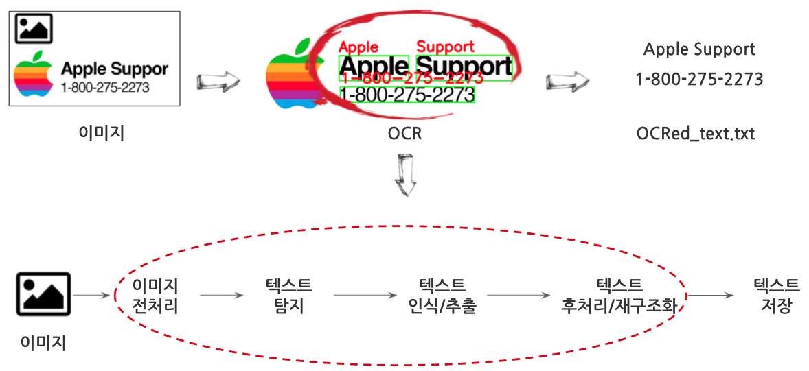

```{r, include=FALSE}
knitr::opts_chunk$set(echo = TRUE, warning=FALSE, message=FALSE,
                    comment="", digits = 3, tidy = FALSE, prompt = FALSE, fig.align = 'center')

library(tidyverse)
```


# OCR이란? {#ocr-definition}

**광학문자인식** (OCR, Optical Character Recognition)은 이미지 혹은 사진 속에 담긴 텍스트를 기계가 읽을 수 있는 형태(Machine-Readable Format)로 변환시켜 텍스트를 선택, 편집, 검색 가능하게 만드는 일련의 작업을 지칭한다.

# OCR 응용분야 {#ocr-application}

OCR 응용분야로 다음을 들 수 있다.

-   인보이스 데이터 자동 입력: 인보이스와 같은 (반)정형 문서에 포함된 텍스트를 OCR로 읽어 정형데이터를 추출한다.
-   여권 MRZ 추출: 여권과 같은 증명서에서 MRC (Machine Readable Zone) 영역에서 텍스트를 추출하여 대사작업에 활용한다.
-   차량번호판 인식: 주차차량 관리 및 주차요금 정산을 위한 차량 번호판 인식
-   교통 표시판 인식: 자율주행차가 교통법규 준수를 위한 다양한 교통 표시판 인식
-   고문서 스캔: 절판되거나 도서관에 보관된 책을 스캔하여 검색 및 자연어 처리 업무를 위한 OCR 작업
-   시각 장애인: OCR 기술을 사용해서 추출된 텍스트 데이터를 TTS(Text-to-Speech)를 사용해서 시각장애인의 정보 접근성을 높일 수 있다.


# OCR 작업흐름 {#ocr-workflow}

OCR 작업흐름은 텍스트가 담긴 이미지를 바로 OCR 작업을 돌릴 경우 정확도가 떨어지기 때문에 이미지 전처리 작업(회전, 노이즈 제거 등)을 수행하고 텍스트 추출작업을 수행한다. 그리고 나서 추출된 텍스트를 후처리 작업을 통해서 재구조화시키고 나서 텍스트를 저장하는 과정을 거치게 된다.



# OCR 알고리즘 {#ocr-algorithms}

텍스트가 포함된 이미지가 있는 상태에서 이미지 전처리(이미지 정규화, 그레이스케일 변환, 이미지 크기 변환, 노이즈 제거, 기울어진 보정 등) 작업을 수행한 후에 이미지 속 텍스트를 탐지하기 위한 알고리즘과 이미지에서 텍스트를 인식하고 추출하는 과정이 핵심적인 과정으로 이에 따라 OCR 성능이 많이 좌우된다.

-   텍스트 탐지 (Text Detection)

    -   EAST 알고리즘(Efficient and Accurate Scene Text Detector) [@zhou2017east]
    -   CTPN 알고리즘(Connectionist Text Proposal Network) [@tian2016detecting]

-   텍스트 인식/추출

    -   CRNN 알고리즘 (Convolutional Recurrent Neural Network) [@shi2016end]
    -   CTC 알고리즘 (Connectionist Temporal Classification) [@graves2006connectionist]


# OCR 데이터셋 {#ocr-dataset}

[Total Text Dataset](https://github.com/cs-chan/Total-Text-Dataset)은 다양한 형태 OCR 대상 이미지 데이터를 상황별로 모아놨다.

## 텍스트 탐지 데이터셋 {#ocr-dataset-text-detection}

{width="388"}

## 텍스트 인식/추출 데이터셋 {#ocr-dataset-text-recognition}

-   [ICDAR datasets](https://rrc.cvc.uab.es/)
-   [MJSynth Dataset](https://www.robots.ox.ac.uk/~vgg/data/text/#sec-synth)
-   [IIIT 5K-word dataset](https://cvit.iiit.ac.in/research/projects/cvit-projects/the-iiit-5k-word-dataset)
-   [Street View House Numbers (SVHN) Dataset](http://ufldl.stanford.edu/housenumbers/)
