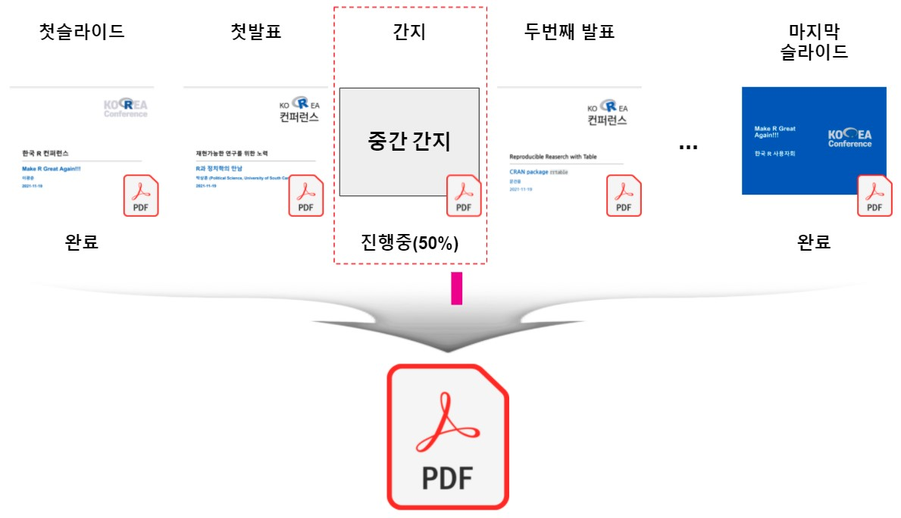
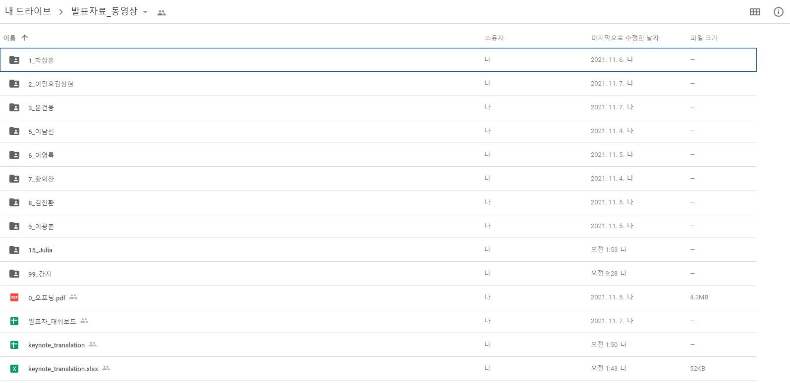

```{r setup, include=FALSE}
knitr::opts_chunk$set(echo = TRUE, message=FALSE, warning=FALSE,
                      comment="", digits = 3, tidy = FALSE, prompt = FALSE, fig.align = 'center')
```



# 한국 R 컨퍼런스 발표자료 {#rconf}

구글 드라이브에서 취합된 발표자 정보를 확인한다. "발표자료_동영상" 폴더에 각 발표자 발표자료 PDF 파일과 동영상을 저장시켜 추후 관리를 수월히 할 수 있도록 한다.

{width="305"}

```{r pdf-conference-files, eval = FALSE}
library(googledrive)
library(tidyverse)

# drive_auth()

rconf_pdf_raw <- drive_find(type = "pdf")

rconf_pdf <- rconf_pdf_raw %>%
  filter(str_detect(name, "^[0-9]{1,2}_.*\\.pdf$"))

rconf_pdf %>% 
  select(name)
```

# 구글 드라이브 다운로드 {#rconf-googledrive}

발표자료는 크기가 크지 않기 때문에 발표자료를 구글 드라이브에서 로컬 컴퓨터로 다운로드해서 작업한다.
파일 하나를 테스트로 다운로드 해보고, 정상동작되는 것을 확인하고 한번에 파일을 다운로드 한다.

```{r download-file, eval = FALSE}
# drive_download(rconf_pdf$name[1], path = glue::glue("data/rconf/{rconf_pdf$name[1]}"), overwrite = TRUE)

download_files <- glue::glue("data/rconf/{rconf_pdf$name}")
walk2(rconf_pdf$name, download_files, drive_download, overwrite = TRUE)

# File downloaded:
#   * 1_박상훈.pdf
# Saved locally as:
#   * data/rconf/1_박상훈.pdf
# File downloaded:
#   * 0_오프닝.pdf
# Saved locally as:
#   * data/rconf/0_오프닝.pdf
# File downloaded:
#   * 3_문건웅.pdf
# Saved locally as:
#   * data/rconf/3_문건웅.pdf
# File downloaded:
#   * 2_이민호김상현.pdf
# Saved locally as:
#   * data/rconf/2_이민호김상현.pdf
# File downloaded:
#   * 6_이영록.pdf
# Saved locally as:
#   * data/rconf/6_이영록.pdf
# File downloaded:
#   * 5_이남신.pdf
# Saved locally as:
#   * data/rconf/5_이남신.pdf
# File downloaded:
#   * 8_김진환.pdf
# Saved locally as:
#   * data/rconf/8_김진환.pdf
# File downloaded:
#   * 9_이광춘.pdf
# Saved locally as:
#   * data/rconf/9_이광춘.pdf
# File downloaded:
#   * 15_Julia.pdf
# Saved locally as:
#   * data/rconf/15_Julia.pdf
# File downloaded:
#   * 7_황의찬.pdf
# Saved locally as:
#   * data/rconf/7_황의찬.pdf
```


# 방송용 PDF 한파일 작성 {#rconf-googledrive-onefile}

방송용으로 PDF 파일을 하나로 작성하는 작업을 수행한다.

## 첫장, 간지, 마지막장 {#start-slipsheet}

먼저 첫장과, 마지막장, 그리고 간지를 준비해보자.
PDF 파일로 완성을 할 것이라... 각 장을 모두 PDF 파일로 준비한다.

```{r make-one-pdf-file}
library(magick)
library(pdftools)

opening_pdf <- magick::image_read_pdf("data/rconf/0_오프닝.pdf")

## 첫장 --------------------------------------
opening_pdf[1] %>% 
  image_annotate(text = "start", size = 100, color = "red", location = "+200+200") %>% 
  magick::image_write("data/rconf/start.pdf", format = "pdf")

## 마지막 장 ---------------------------------
opening_pdf[length(opening_pdf)] %>% 
  image_annotate(text = "end", size = 100, color = "red", location = "+200+200") %>%   
  magick::image_write("data/rconf/end.pdf", format = "pdf")

## 간지 --------------------------------------
slipsheet <- image_read("fig/r-hexstickers.jpg")

slipsheet %>% 
  image_annotate(text = "Slipsheet", size = 177, color = "red", location = "+200+200") %>% 
  magick::image_write("data/rconf/slipsheet.pdf", format = "pdf")
```


## 발표자료 병합 {#start-slipsheet-merge}

PDF 발표자료를 모두 불러읽어 들여 이를 하나의 파일로 만드는 작업을 수행하자. 이를 위해서 각 발표자료 앞에 간지를 붙이는 작업을 먼저 수행하고 나서 최종적으로 각 파일을 결합한다.

```{r make-one-pdf-file-merge, error = TRUE}
library(pdftools)

slideshow_list <- list()

test_pdf <- pdftools::pdf_combine(c("data/rconf/slipsheet.pdf", enc2utf8("data/rconf/1_박상훈.pdf")))

```


