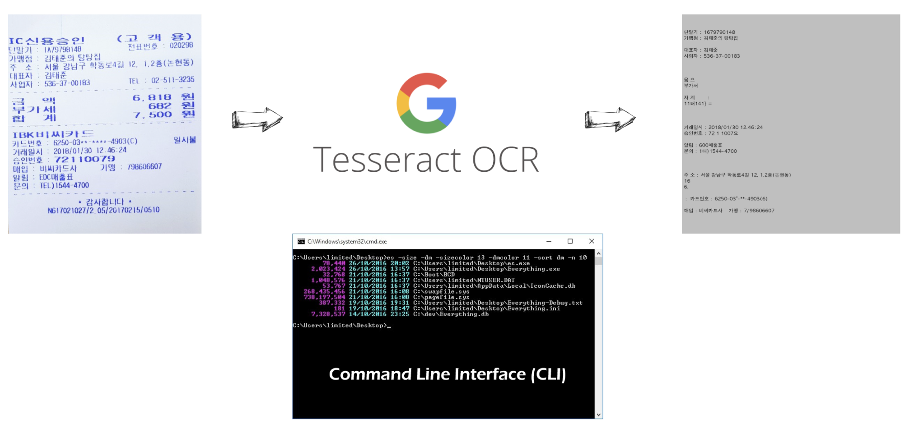
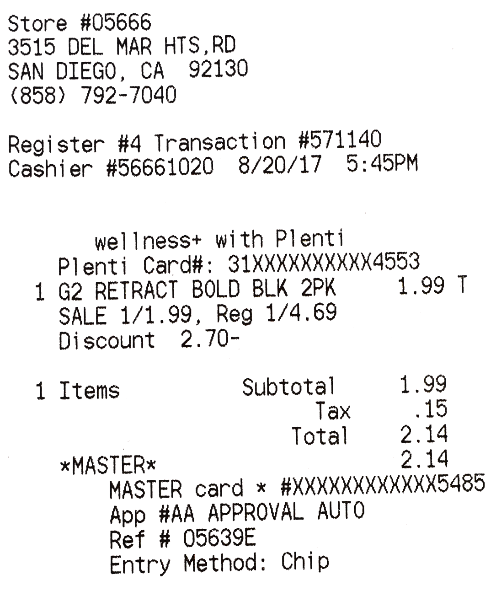
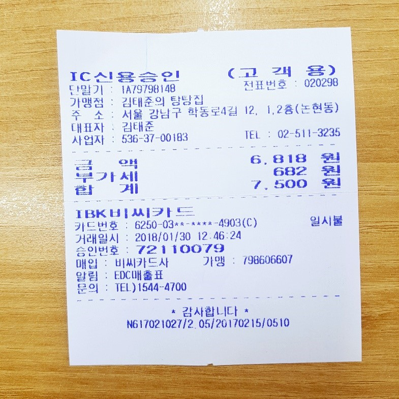
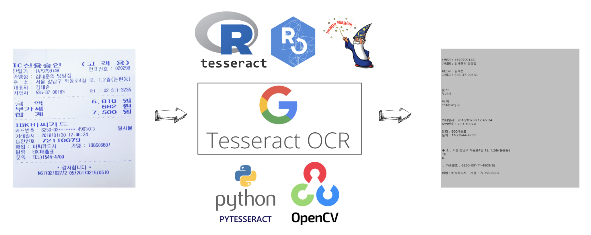
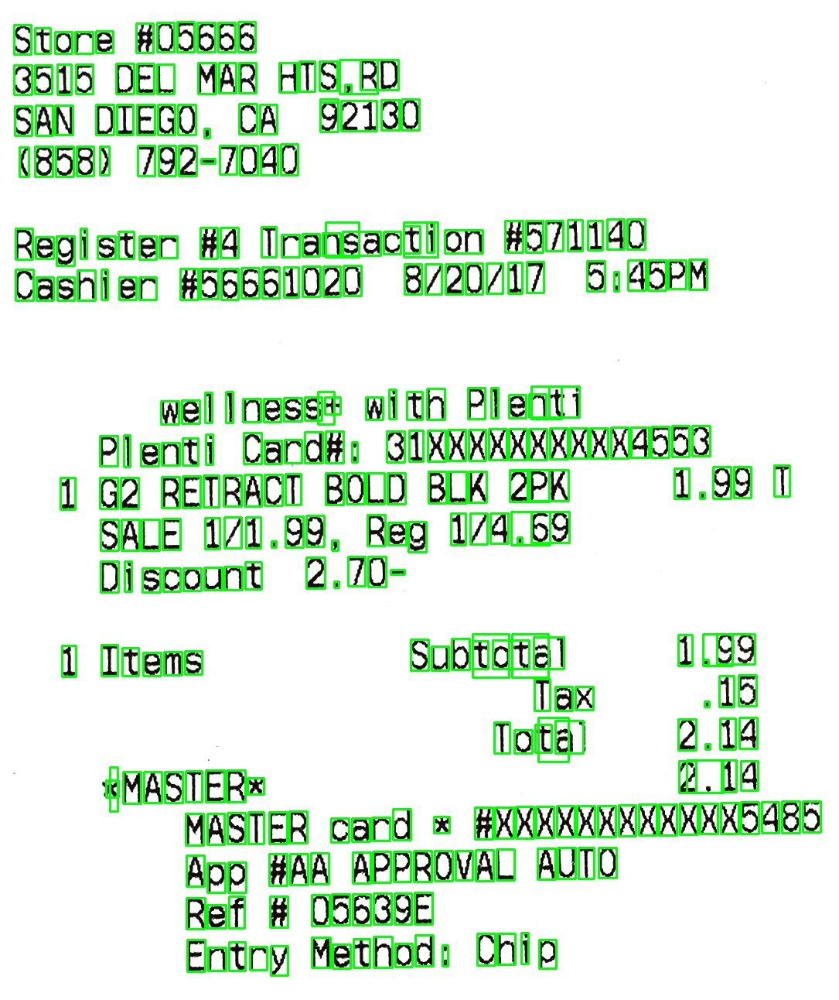

```{r, include=FALSE}
knitr::opts_chunk$set(echo = TRUE, warning=FALSE, message=FALSE,
                    comment="", digits = 3, tidy = FALSE, prompt = FALSE, fig.align = 'center')

library(tidyverse)
```



# `tesseract` 설치 [^1] {#install-mac}

[^1]: [tessdoc - `tesseract`](https://tesseract-ocr.github.io/tessdoc/Installation.html)

맥에서 tesseract를 설치할 경우 [tessdoc - `tesseract`](https://tesseract-ocr.github.io/tessdoc/Installation.html)을 참조하여 운영체제에 맞춰 설치하면 된다. [언어팩](https://ports.macports.org/?search=tesseract-&search_by=name)에서 보면 한국어가 존재하지 않는다. ㅠ.ㅠ

```{r install-mac, eval=FALSE}
# MacPorts
sudo port install tesseract

# Homebrew
brew install tesseract

# 한국어 모듈 설치
brew install tesseract-lang
```

## CLI 테스트 {#test-OCR}

다음 단계로 tesseract 를 활용하여 CLI에서 이미지속에 담긴 텍스트를 추출해보자. `fig/ocr-receipt.png` 이미지를 대상으로 CLI에서 텍스트를 인식해보자.

{width="453"}

먼저 영수증을 tesseract로 인식해서 `fig/ocr-receipt.txt` 파일로 저장한다. 언어는 영어로 지정한다.

```{bash cli-test}
tesseract fig/ocr-receipt.png fig/ocr-receipt -l eng
```

영수증을 OCR 한 결과와 원본 영수증 이미지를 검증하고자 원문 영수증 이미지와 OCR 된 결과를 한 이미지로 묶어 준비한다.

```{r check-ocr-result}
library(tidyverse)
library(magick)

receipt_png <- image_read("fig/ocr-receipt.png")

receipt_png <- receipt_png %>% 
  image_resize("700x710")

white_png <- image_blank(width  = image_info(receipt_png) %>% select(width) %>% pull, 
                         height = image_info(receipt_png) %>% select(height) %>% pull, 
                         color = "gray75", pseudo_image = "", defines = NULL)

combined_img <- c(receipt_png, white_png)

image_append(combined_img, stack = FALSE)
```

OCR된 텍스트 파일을 불러읽어 원본 영수증 이미지와 대사하기 위해 이미지에 찍어둔다.

```{r OCRed-image}
OCRed_text <- read_lines("fig/ocr-receipt.txt")

OCRed_text <- paste0(OCRed_text, collapse = "\n")

OCRed_png <- white_png %>% 
  image_annotate(OCRed_text, location = "+10+10", size = 19, font = "AppleGothic")

OCRed_png
```

원본 영수증 이미지와 OCR된 결과 이미지를 결합시켜 눈으로 결과를 파악한다.

```{r OCRed-image-combined}
image_append(c(receipt_png, OCRed_png), stack = FALSE)
```

## 한글 OCR 테스트 {#test-OCR-korean}

이번에는 한글 영수증을 하나 구해 OCR 작업을 수행해보자. 한글이 포함된 이미지라는 것을 알기 때문에 `-l kor`로 언어로 한글을 지정하여 한글을 우선 인식한다.

{width="368"}

```{bash korean-receipt}
tesseract fig/ocr-receipt-korean.jpg fig/ocr-receipt-korean -l kor
```

상기 작업결과는 `fig/ocr-receipt-korean.txt` 파일에 저장된다.

OCR 결과 검증을 위해서 한글 영수증 이미지와 OCR 된 텍스트를 함께 나란히 놓고 비교해 보자.

```{r display-ocred-image}

display_ocr_text <- function() {
  ## 원본 이미지
  receipt_image <- image_read("fig/ocr-receipt-korean.jpg")
  
  receipt_image <- receipt_image %>%
    image_resize("700x710")

  ## 빈 도화지 + OCR된 텍스트
  white_image <- image_blank(width  = image_info(receipt_image) %>% select(width) %>% pull, 
                           height = image_info(receipt_image) %>% select(height) %>% pull, 
                           color = "gray75", pseudo_image = "", defines = NULL)

  OCRed_korean_text <- read_lines("fig/ocr-receipt-korean.txt")
  
  OCRed_korean_text <- paste0(OCRed_korean_text, collapse = "\n")
  
  OCRed_korean_png <- white_image %>% 
    image_annotate(OCRed_korean_text, location = "+10+10", size = 15, font = "AppleGothic")
  
  ## 결합
  receipt_ocr_img <- c(receipt_image, OCRed_korean_png)
  
  return(image_append(receipt_ocr_img, stack = FALSE))
}

display_ocr_text()
```

# R `tesseract`와 파이썬 `pytesseract` {#pytesseract}

[`pytesseract`](https://pypi.org/project/pytesseract/)는 `tesseract`를 파이썬에서 사용할 수 있도록 wrapper로 감싼 파이썬 팩키지다. CLI 에서 작업했던 결과를 파이썬 객체로 얻어 후속작업을 진행할 수 있도록 한다. 마찬가지로 [`tesseract`](https://cran.r-project.org/web/packages/tesseract/index.html)는 R 팩키지로 [`pytesseract`](https://pypi.org/project/pytesseract/)와 동일한 역할을 수행한다고 이해할 수 있다.



## R `tesseract` 팩키지 {#r-tesseract-pkg}

R 팩키지에 포함된 tesseract 엔진을 이용하여 OCR 작업을 수행하고 탐지한 텍스트를 녹색 상자를 잡아 인식된 텍스트와 값을 확인한다.

```{r magick-view}
library(tesseract)
library(tidyverse)
library(magick)
# R OCR --------------------------------------------------
kor <- tesseract("kor")
OCRed_res <- tesseract::ocr_data('fig/ocr-receipt-korean.jpg', engine = kor)
OCRed_text <- tesseract::ocr('fig/ocr-receipt-korean.jpg', engine = kor)

results_tbl <- OCRed_res %>% 
  mutate(loc = str_split(bbox, ",")) %>% 
  mutate(top_x = map_chr(loc, 1),
         top_y = map_chr(loc, 2),
         bottom_x = map_chr(loc, 3),
         bottom_y = map_chr(loc, 4)) %>% 
  filter(confidence > 0.95)

# OCR된 이미지 시각화 ------------------------------------
receipt_image <- image_read('fig/ocr-receipt-korean.jpg')

document_box <- image_draw(receipt_image)

rect(results_tbl$top_x, 
     results_tbl$top_y, 
     results_tbl$bottom_x, 
     results_tbl$bottom_y, border = "green", lty = "solid", lwd = 3)

document_box
```

영수증에서 추출한 OCR된 텍스트는 다음과 같다.

```{r ocr-receipt-text}
OCRed_text
```

## 파이썬 `pytesseract` {#pytesseract-in-action}

[Getting the bounding box of the recognized words using python-tesseract](https://stackoverflow.com/questions/20831612/getting-the-bounding-box-of-the-recognized-words-using-python-tesseract)을 참조하여 파이썬에서 `tesseract`를 호출하여 OCR 작업을 수행하고 결과값을 시각화해보자.

먼저 Open-CV와 `pytesseract` 팩키지를 설치한다.

-   `pip install opencv-python`
-   `pip install pytesseract`

다음 단계로 `which tesseract` 명령어를 통해서 `tesseract` 실행파일 위치를 지정하고 OCR 작업을 수행한다. OCR 작업 결과를 통해 궁극적으로 달성하려고 하는 바는 데이터베이스에서 종이에 찍힌 정형ㅌ데이터를 복원하는 것으로 해당 Key값을 정의하고 Value에 해당되는 값을 추출해 낸다.

```{python activate-pytesseract}
# 환경설정 ------------------
import cv2
import pytesseract

pytesseract.pytesseract.tesseract_cmd = r"/usr/local/bin/tesseract"

# OCR 작업 ------------------
receipt_img = cv2.imread('fig/ocr-receipt.png')
receipt_text = pytesseract.image_to_string(receipt_img, config = r'--psm 3', lang = 'eng')

# OCR 작업결과 저장 ------------------
with open('fig/receipt_pytesseract_eng.txt', mode = 'w') as f:
    f.write(receipt_text)

# 데이터 정형화 작업 ------------------
structured_data = {}

with open('fig/receipt_pytesseract_eng.txt', 'r') as ocr_file:
    line_lst = ocr_file.readlines()

for line in line_lst:
    line_strip = line.strip()
    if 'Store' in line_strip:
        structured_data['Store'] = " ".join(line_strip.split()[1:])
    if '(' in line_strip:
        structured_data['Phone'] = " ".join(line_strip.split())
    if 'Total' in line_strip:
        structured_data['Price'] = " ".join(line_strip.split()[1:])
    if 'MASTER' in line_strip:
        structured_data['Master Card'] = line_strip.split()[-1]

print(structured_data)
```

OCR 작업을 수행하면서 제대로 텍스트를 탐지했는지 Bounding Box 를 지정하여 시각적으로 확인한다.

```{python activate-pytesseract-viz, eval = FALSE}
# 원본 이미지 텍스트 위치 파악 ------------------------------------- 

h, w, _ = receipt_img.shape # assumes color image

# run tesseract, returning the bounding boxes
boxes = pytesseract.image_to_boxes(receipt_img)

# draw the bounding boxes on the image
for b in boxes.splitlines():
    b = b.split(' ')
    receipt_img = cv2.rectangle(receipt_img, (int(b[1]), h - int(b[2])), (int(b[3]), h - int(b[4])), (0, 255, 0), 2)

# show annotated image and wait for keypress
# cv2.imshow("Receipt OC", receipt_img)
# cv2.waitKey(0)

# Save OCR image
cv2.imwrite("fig/ocr-receipt-pytesseract.jpg", receipt_img)
```

{width="367"}
