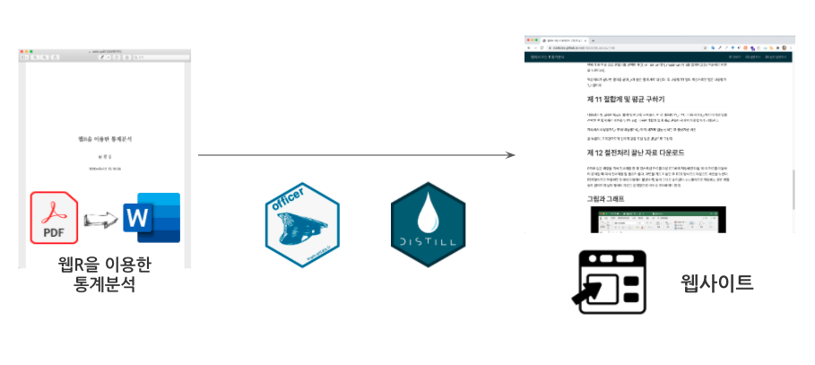
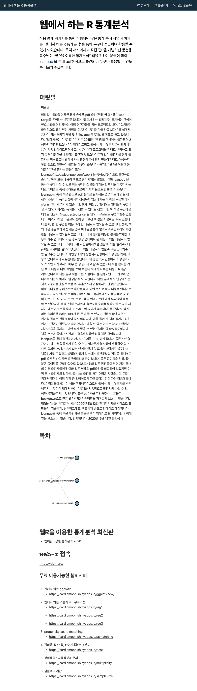

```{r setup, include=FALSE}
knitr::opts_chunk$set(echo = TRUE, message=FALSE, warning=FALSE,
                      comment="", digits = 3, tidy = FALSE, prompt = FALSE, fig.align = 'center')

```



# 웹R을 이용한 통계분석 {#webr-stat}

[웹R을 이용한 통계분석](https://bookdown.org/cardiomoon/webrbook2020/)은 [웹R](http://web-r.org/) 웹사이트을 통해 웹에서 통계분석을 할 수 있는 통계팩키지 기능을 제공하는 방식을 정리한 PDF 파일이다. PDF 파일을 파싱하여 웹사이트를 만드는 과정을 살펴보자.

# [웹R을 이용한 통계분석](https://leanpub.com/webr) → PDF {#leanpub-pdf}

leanpub에 올라온 [웹R을 이용한 통계분석](https://leanpub.com/webr) PDF 파일을 다운로드 받아 살펴보자.

```{r show-webr-pdf, out.height = "460px", out.width='800px', echo=TRUE}
knitr::include_graphics("data/webr.pdf")
```

# PDF → 이미지 추출 {#image-extraction}

PDF에 포함된 이미지를 추출하는 방식은 몇가지가 존재한다. 먼저 쉘에서 [`poppler`](https://poppler.freedesktop.org/)를 사용해서 PDF 파일에 포함된 이미지 파일을 있는 그대로 저장하는 방식을 활용해 보자.

```{r brew-install-poppler, eval = FALSE}
$ brew install poppler
$ mkdir images/
$ pdfimages -all webr.pdf ./images/
```

`slickR`기능을 활용하여 [웹R을 이용한 통계분석](https://leanpub.com/webr) PDF 파일 1장에 포함된 모든 이미지를 추출해낸다.

```{r images-slickr-ch01, eval = TRUE}
library(tidyverse)
library(slickR)

webr_img <- fs::dir_ls(path = "data/images/", glob = "*.png")
webr_tbl <- tibble(fig = glue::glue("{webr_img}") )

ch1_img_tbl <- webr_tbl %>% 
  mutate(page = str_extract(fig, pattern = "\\d+") %>% as.integer) %>% 
  filter(page %% 2 == 0) %>% 
  filter(page >= 0 & page <= 33)
  
slickR(ch1_img_tbl$fig, height = 600)
```

# PDF → 워드 변환 {#pdf2word}

[PDF를 데이터로 보는 올바른 자세: PDF → 워드(`.docx`)](https://statkclee.github.io/pdf/pdf-to-word.html)을 참고하여 PDF 파일을 워드로 변환시킨다. 아도브(Adobe) 회사의 애크로뱃 제품(Adobe Acrobat Pro)을 사용해서 PDF 파일을 워드로 변환시킬 경우 언어가 영어가 아니라 한국어로 설정하여 한글 PDF 글자를 제대로 변환시킬 수 있도록 한다.


# PDF → 목차 추출 {#pdf2toc}

## 데이터 추출 {#pdf2toc-dataframe}

`pdftools` 팩키지 `pdf_toc()` 함수를 사용해서 목차(Table of Contents)를 추출해낸다. 자료구조가 리스트라 이를 데이터프레임으로 변경하는 작업을 `tidyr` 팩키지 동사를 사용해서 수행한다.

```{r pdf2toc-dataframe}
# 1. TOC 전처리 ----------------------
webr_toc <- pdftools::pdf_toc(glue::glue("{here::here()}/data/webr.pdf"))

webr_toc_lvl_01 <- pluck(webr_toc, "children")

## 1.1. 중제목
webr_toc_subtitle <- pluck(webr_toc_lvl_01, 1) %>% 
  as_tibble() %>% 
  unnest_longer(children) %>% 
  filter(children_id == "title") %>% 
  mutate(subtitle = map_chr(children, 1)) %>% 
  select(title, subtitle)

## 1.2. 소제목
get_subtitle <- function(chapter) {
  pluck(webr_toc_lvl_01, 1) %>% 
  as_tibble() %>% 
  unnest_longer(children) %>% 
  filter(row_number() == 2 * chapter) %>% 
  unnest(children) %>% 
  mutate(subsubtitle = map_chr(children, 1)) %>% 
  mutate(subtitle = webr_toc_subtitle$subtitle[chapter]) %>% 
  select(title, subtitle, subsubtitle)
}  

# get_subtitle(3)

## 1.3. TOC 결합

webr_toc_tbl <- get_subtitle(1) %>% 
  bind_rows(get_subtitle(2)) %>% 
  bind_rows(get_subtitle(3)) 

webr_toc_tbl
```

## 목차 시각화 {#pdf2toc-dataframe-viz}

목차를 가장 잘 시각화할 수 있는 방법중 하나인 `collapsibleTree` 팩키지를 사용해서 시각화한다.

```{r webr-toc-tree}
library(collapsibleTree)

collapsibleTree(webr_toc_tbl, 
                hierarchy  = c("subtitle", "subsubtitle"),
                root       = "웹R 통계분석",
                tooltip    = TRUE,
                attributes = "title",
                fill       = "#64ABC2",
                collapsed  = TRUE, 
                width      = 800,
                zoomable   = FALSE)
```

# PDF → 머리말 추출 {#pdf2preface}

`pdftools` 팩키지 `pdf_text()` 함수를 사용해서 머리말에 해당되는 텍스트를 추출해서 이를 보기편한 형태로 변환시킨다.

```{r webr-preface}
webr_txt <- pdftools::pdf_text(glue::glue("{here::here()}/data/webr.pdf"))

webr_preface <- str_c(webr_txt[[2]], webr_txt[[3]]) %>% 
  str_remove_all(pattern = "\r\n") %>% 
  str_remove_all(pattern = "(\n)")  %>% 
  str_remove_all(pattern = "\\\\")

webr_preface_tbl <- tribble( ~"머릿말",
                             webr_preface)
webr_preface_tbl %>% 
  reactable::reactable()
```

# 워드 → 각 장/절항/추출 {#extract-chapter}

R 덩어리 코드에 `results='asis'`을 인자로 넣어 `officer` 팩키지에서 추출한 워드 장/절/항/문단 텍스트가 마크다운 형식으로 변환되어 바로 HTML 웹사이트 문서로 변환될 수 있도록 작업한다.

```{r chapter-01, results='asis'}
library(officer)

webr_docx <- officer::read_docx("data/webr.docx")

webr_content <- docx_summary(webr_docx) %>% 
  as_tibble()

# 각 장 위치 파악 -----------------
ch01_start_idx <- which(webr_content$text == "제 1 장")
ch02_start_idx <- which(webr_content$text == "제 2 장")
ch03_start_idx <- which(webr_content$text == "제 3 장")

# 제 1 장 추출 -----------------
ch01_raw <- webr_content %>% 
  mutate(text = str_remove(text, pattern = "\\d{15}")) %>% 
  filter(between(row_number(), ch01_start_idx, ch02_start_idx - 1)) %>% 
  filter(!text == "") %>% 
  select(style_name, text)
ch01_md <- ch01_raw %>% 
  filter(!str_detect(text, "제\\s?[0-9]\\s?장")) %>% 
  slice(2:n()) %>%   
  mutate(markdown = case_when(style_name == "heading 1"             ~ glue::glue("# {text} \n\n"),
                              str_detect(text, "제\\s?[0-9]\\s?절") ~ glue::glue("## {text} \n\n"),
                              style_name == "heading 3"             ~ glue::glue("### {text} \n\n"),
                              TRUE                                  ~ glue::glue("{text} \n\n"))) %>% 
  pull(markdown)

print(ch01_md)
```

# 웹사이트 {#create-website}

`distill` 팩키지 **Project Type**을 `Distill Website`로 설정하여 웹사이트를 제작한다. 앞서 추출한 각 장(chapter)을 웹페이지로 작성하고 `_site.yml` 파일에 HTML 파일을 연결시켜 놓고 `gh-pages` 기능을 활성화 시키면 웹사이트 제작이 가능하다.

-   [**https://statkclee.github.io/webr-book/**](https://statkclee.github.io/webr-book/){.uri}

```{r webr-yaml, eval = FALSE}
name: "webr-book"
title: "웹에서 하는 R 통계분석"
author: "문건웅"
description: |
  웹R을 이용한 통계분석" 책을 원하는 분들이 많아 [leanpub](https://leanpub.com/webr) 을 통해 pdf형식으로 출간되어 누구나 활용이 가능합니다.
output_dir: "."
navbar:
  right:
    - text: "01 맛보기"
      href: 01_helloworld.html      
    - text: "02 설문조사"
      href: 02_survey.html      
    - text: "03 실전 설문조사"
      href: 03_survey_advanced.html            
output: distill::distill_article
```

웹사이트를 `webshot2`로 찍어 박제한다.

```{r screenshot, eval = FALSE}
webshot2::webshot(url = "https://statkclee.github.io/webr-book/", file = "fig/webr-website.png")
```


