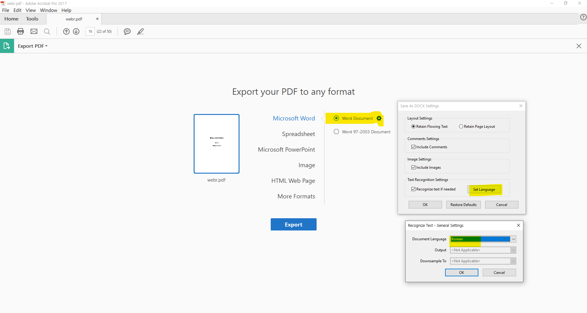

```{r setup, include=FALSE}
knitr::opts_chunk$set(echo = TRUE, message=FALSE, warning=FALSE,
                      comment="", digits = 3, tidy = FALSE, prompt = FALSE, fig.align = 'center')

```


# 웹R을 이용한 통계분석 {#webr-stat}

[웹R을 이용한 통계분석](https://bookdown.org/cardiomoon/webrbook2020/)은 [웹R](http://web-r.org/) 웹사이트을 통해 웹에서 통계분석을 할 수 있는 통계팩키지 기능을 제공하는 방식을 정리한 PDF 파일이다. PDF 파일을 파싱하여 웹사이트를 만드는 과정을 살펴보자.

# [웹R을 이용한 통계분석](https://leanpub.com/webr) &rarr; PDF {#leanpub-pdf}

leanpub에 올라온 [웹R을 이용한 통계분석](https://leanpub.com/webr) PDF 파일을 다운로드 받아 살펴보자.

```{r show-webr-pdf, out.height = "460px", out.width='800px', echo=TRUE}
knitr::include_graphics("data/webr.pdf")
```

# PDF &rarr; 이미지 추출 {#image-extraction}

PDF에 포함된 이미지를 추출하는 방식은 몇가지가 존재한다. 먼저 쉘에서 [`poppler`](https://poppler.freedesktop.org/)를 사용해서 PDF 파일에 포함된 이미지 파일을 있는 그대로 저장하는 방식을 활용해 보자.

```{r brew-install-poppler, eval = FALSE}
$ brew install poppler
$ mkdir images/
$ pdfimages -all webr.pdf ./images/
```

`slickR`기능을 활용하여 [웹R을 이용한 통계분석](https://leanpub.com/webr) PDF 파일 1장에 포함된 모든 이미지를 추출해낸다.

```{r images-slickr-ch01, eval = TRUE}
library(tidyverse)
library(slickR)

webr_img <- fs::dir_ls(path = "data/images/", glob = "*.png")
webr_tbl <- tibble(fig = glue::glue("{webr_img}") )

ch1_img_tbl <- webr_tbl %>% 
  mutate(page = str_extract(fig, pattern = "\\d+") %>% as.integer) %>% 
  filter(page %% 2 == 0) %>% 
  filter(page >= 0 & page <= 33)
  
slickR(ch1_img_tbl$fig, height = 600)
```

# PDF &rarr; 워드 변환 {#pdf2word}

[PDF를 데이터로 보는 올바른 자세: PDF &rarr; 워드(`.docx`)](https://statkclee.github.io/pdf/pdf-to-word.html)을 참고하여 PDF 파일을 워드로 변환시킨다. 아도브(Adobe) 회사의 애크로뱃 제품(Adobe Acrobat Pro)을 사용해서 PDF 파일을 워드로 변환시킬 경우 언어가 영어가 아니라 한국어로 설정하여 한글 PDF 글자를 제대로 변환시킬 수 있도록 한다.




