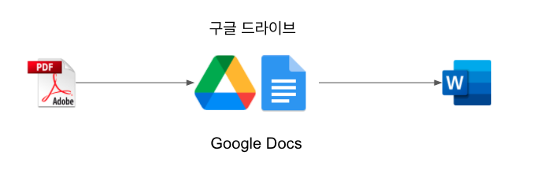
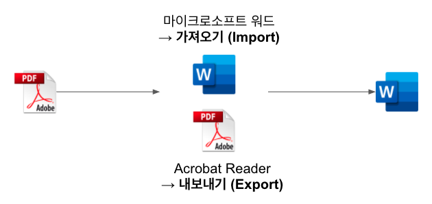
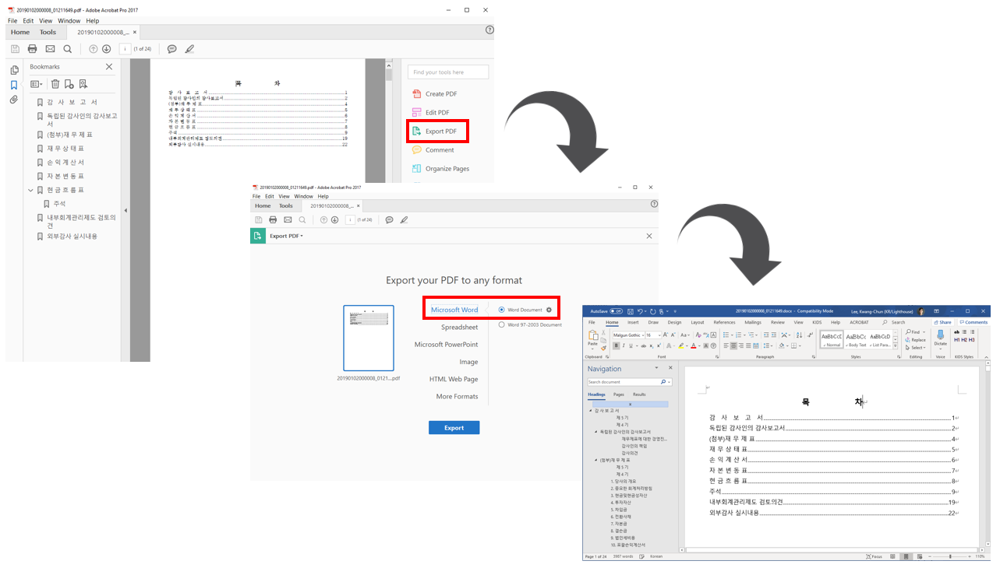
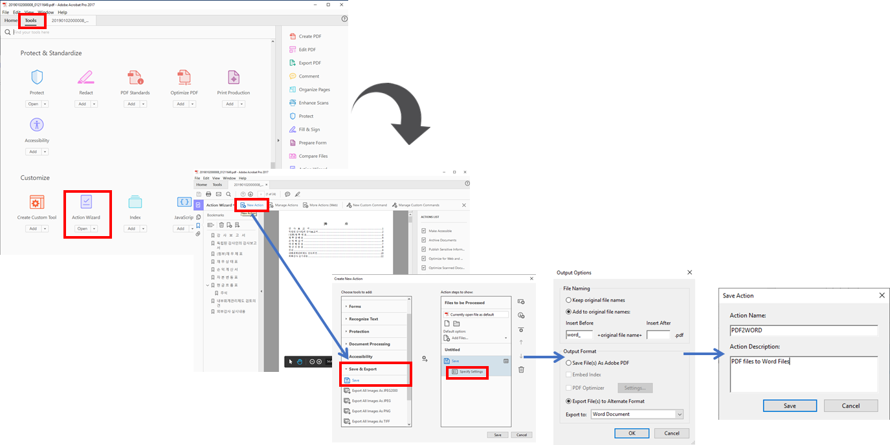
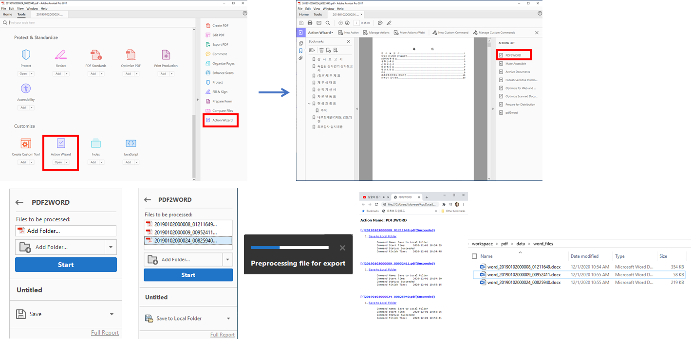

```{r setup, include=FALSE}
knitr::opts_chunk$set(echo = TRUE, message=FALSE, warning=FALSE,
                      comment="", digits = 3, tidy = FALSE, prompt = FALSE, fig.align = 'center')

```


# PDF 파일 워드 변환 {#convert-pdf-to-word}

PDF 파일을 워드 파일로 변환하는 방법은 다양하다. 개념적으로는 구글 독스로 PDF 파일을 불러읽어 들인 후 워드로 내보내는 방법이 있고, 워드에서 PDF 파일을 불러와서 워드 파일로 변환시키는 방법도 있고, Acrobat Reader에서 상용버전을 구입하여 읽어들인 PDF 파일을 워드로 내보내는 방법도 있다. 

## PDF &rarr; 구글 독스 &rarr; 워드 [^convert-pdf-with-google] {#convert-pdf-to-google}

[^convert-pdf-with-google]: [Converting a PDF file to a Word Document (for free) using Google Docs](https://pdfblog.com/2018/02/27/converting-a-pdf-file-to-a-word-document-for-free-using-google-docs/)

먼저 최근 구글 독스(Google Docs) 성능이 좋아져서 PDF 파일을 구글 클라우드에 올려 이를 구글 독스로 변환시켜 편집가능한 형태로 만드는 방법을 활용하여 마이크로소프트 워드로 파일형태를 변형시켜 원하는 결과를 얻는다.
'



## PDF &rarr; MS Word/Acrobat Reader &rarr; 워드 [^open-pdf-with-word] {#convert-pdf-with-libreoffice}

[^open-pdf-with-word]: ["WikiHow", How to Open PDF in Word](https://www.wikihow.com/Open-PDF-in-Word)

"Data science and its relationship to big data and data-driven decision making" [@provost2013data] 논문을 편집가능한 워드 파일로 변환시키는 방법은 마이크로소프트 워드에서 PDF 파일을 읽는 방법, Acrobat Reader에서 PDF 파일을 읽어 들인 후 워드파일로 내보내는 방법도 있다. 



# $\LaTeX$ &rarr; 워드 [^latex-to-word] {#latex-to-word}

[^latex-to-word]: [Zhelin Chen (Feb 25, 2019), "How to Convert from Latex to MS Word with ‘Pandoc’" Medium.com](https://medium.com/@zhelinchen91/how-to-convert-from-latex-to-ms-word-with-pandoc-f2045a762293)

학교에서 $\LaTeX$으로 논문을 쓸대는 좋지만 그렇다고 모든 사람들이 논문을 $\LaTeX$으로 작업하는 것도 아니다. 이런 경우 워드로 어쩔 수 없이 작성해야 하는 경우 `pandoc`을 활용하면 파일변환에 따른 불편함을 많이 줄일 수 있다. 그리고 덤으로 워드의 **"Track changes"** 추적기능은 워드로 파일을 변환시키면서 얻는 커다란 장점이 될 수 있다.

`.tex` 파일을 `.docx` 파일로 변환시키는데 이 과정에서 참조(`--filter pandoc-crossref`), 서지관리(`--bibliography=myref.bib`), 그리고 서식(`--reference-docx=IEEE_template.doc`)을 함께 적용시켜 $\LaTeX$ 파일에서 워드파일로 변환시키는 수고를 상당부분 줄일 수 있다.

```{r pandoc-to-world, eval = FALSE}
pandoc paper.tex \
       -o paper.docx \
       --filter pandoc-crossref \
       --bibliography=myref.bib \
       --reference-docx=IEEE_template.doc 
```

# 리브레오피스 &rarr; 워드 {#libreoffice-to-word}

리브레오피스(LibreOffice)를 구성하는 `Writer`는 원래 목적이 워드를 대체하기 위해 만들어졌기 때문에 PDF 파일을 입력으로 받아 워드 파일로 내보낸다는 것이 철학에 반한다.


# Acrobat: `.pdf` &rarr; `.docx` {#convert-pdf-to-word-with-action}

아도브(Adobe) 회사의 애크로뱃 제품(Adobe Acrobat Pro)을 사용해서 PDF 파일을 워드로 변환시켜보자.

## PDF 파일 하나 {#single-pdf-file}

GUI를 사용해서 PDF 파일을 "Export PDF" 기능으로 워드 파일로 변환시킬 수 있다.
"Export PDF" 다음에 "Microsoft Word"를 선택하고 "Word Document"를 선택할 경우 워드파일로 변환시킬 수 있다.




## 다수 PDF 파일 {#many-pdf-files}

만약, PDF 파일이 많은 경우 이와 같은 방식으로 작업하는 것이 경우에 따라서는 불가능하다. 이를 위해서 자동화가 필수적인데 먼저 "Action Wizard"를 통해 자동화 선택옵션을 지정하여 `PDF2WORD` 액션을 생성시킨다.




다음으로 `PDF2WORD` 액션을 실행시켜 PDF 파일을 내보내기하여 워드파일을 다량으로 만들어낸다.



특히 변환된 PDF 파일 앞쪽 혹은 뒤쪽에 접두어(`prefix`)나 접미어를 붙여 식별을 용이하게 하고 다음 후속처리에 수월함을 더한다.

```{r check-word-conversion}
fs::dir_ls(path="data/word_files/")
```

