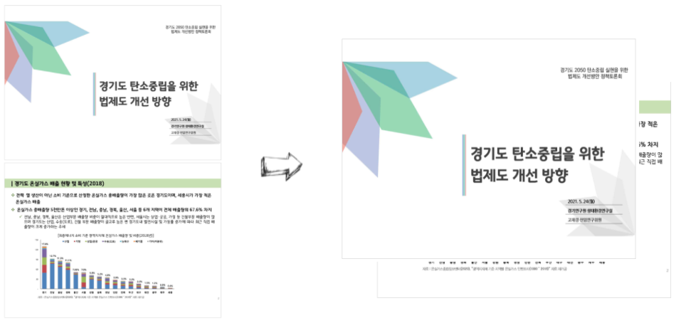

```{r, include=FALSE}
knitr::opts_chunk$set(echo = TRUE, warning=FALSE, message=FALSE,
                    comment="", digits = 3, tidy = FALSE, prompt = FALSE, fig.align = 'center')

library(tidyverse)
```




# PDF 파일 읽기 {#read-pdf-file}

가장 먼저 `magick` 팩키지로 `image_read_pdf` 함수를 사용해서 PDF 파일을 읽어 들이고 해당 슬라이드를 뜯어낼 수 있도록 준비한다.

```{r image-preprocessing}
library(tidyverse)
library(magick)

esg_doc <- magick::image_read_pdf(path = "data/034_0524_경기도 2050 탄소중립 실현을 위한 법제도 개선방안 정책 토론회.pdf", page = 11:28)

esg_doc[1] %>% 
  image_resize("20%")
```

윗쪽 슬라이드와 아래쪽 슬라이드를 한 페이지에 대해서 수행하고 이를 `image_append()` 함수로 붙여낸다.

```{r image-preprocessing-top-bottom}
top_slide <- esg_doc[1] %>% 
  image_crop(geometry = "2300x1330+350+500") %>% 
  image_resize("20%")
  
bottom_slide <- esg_doc[1] %>% 
  image_crop(geometry = "2300x1330+350+1830") %>% 
  image_resize("20%")

first_page <- image_append(c(top_slide, bottom_slide), stack = FALSE)
first_page
```

# 이미지 &rarr; PDF {#save-pdf-file}


```{r write-image-to-pdf}
top_slide <- esg_doc[1] %>% 
  image_crop(geometry = "2300x1330+350+500") 
  
bottom_slide <- esg_doc[1] %>% 
  image_crop(geometry = "2300x1330+350+1830")

image_append(c(top_slide, bottom_slide), stack = TRUE) %>% 
  image_write(path = "data/image2pdf.pdf", density = 300, format = "pdf", flatten = TRUE)
```

```{r embed-pdf, out.height = "460px", out.width='800px', echo=TRUE}
knitr::include_graphics("data/image2pdf.pdf")
```