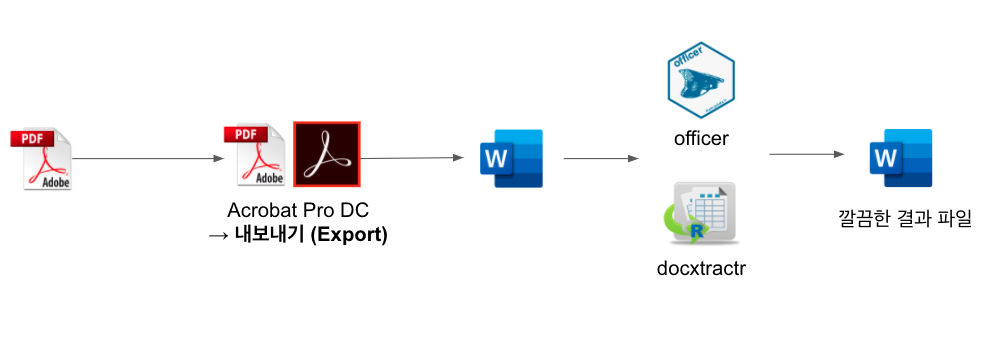

```{r setup, include=FALSE}
knitr::opts_chunk$set(echo = TRUE, message=FALSE, warning=FALSE,
                      comment="", digits = 3, tidy = FALSE, prompt = FALSE, fig.align = 'center')

```




# 워드 관련 팩키지 [^r-word-package]  {#word-packages}

[^r-word-package]: [Gu Kai (2020-04-21), "Create and format Word documents using R", Letter notes](https://www.bioinfo-scrounger.com/archives/create-and-format-Word-documents-using-R/)

워드 파일을 전용으로 개발된 `officer` 팩키지와 워드 파일에서 표를 추출하는 `docxtractr` 팩키지도 있는 반면 텍스트 마이닝이나 자연어 처리 분야에서 다양한 텍스트 데이터를 읽어들이기 위해 개발된 `textreadr`, `readtext` 팩키지도 있다.

- [`officer`](https://davidgohel.github.io/officer/index.html): `officeverse`를 이루는 핵심 팩키지
- [`docxtractr`](https://github.com/hrbrmstr/docxtractr): 워드 문서에서 데이터 표(Data Table)을 추출
    - `xml2`: XML 파일을 파싱하여 XML 표를 추출하는 방식 [^from-xml-table]
- [`trinker/textreadr`](https://github.com/trinker/textreadr): 
- [`quanteda/readtext`](https://github.com/quanteda/readtext)

[^from-xml-table]: [hrbrmstr (2015-08-23), "Using R To Get Data *Out Of* Word Docs", rud.is](https://rud.is/b/2015/08/23/using-r-to-get-data-out-of-word-docs/)


# `officer` {#parsing-docx}

[`officer`](https://davidgohel.github.io/officer/index.html) 팩키지를 사용해서 워드 파일에 담긴 내용을 이해하고 필요한 정보를 추출해 보자. 먼저, `officer` 팩키지 `docx_summary()` 함수를 활용하여 


```{r extract-components-from-docx}
library(tidyverse)
library(officer)
finstmt_docx <- officer::read_docx("data/word_files/word_20190102000008_01211649.docx")
finstmt_content <- docx_summary(finstmt_docx) %>% as_tibble()

finstmt_content
```

문서에서 표와 문단이 각각 차지하는 비율을 각각 계산해 보자. 이를 통해 문단이 얼마를 구성하고 있고 표는 몇개가 있는지 등등을 파악할 수 있다.

```{r calculate-pcnt}
# tapply(finstmt_content$doc_index, finstmt_content$content_type, 
#        function(x) length(unique(x)))

finstmt_content %>% 
  count(doc_index, content_type) %>% 
  select(-n) %>%
  distinct_all() %>% 
  count(content_type)

```

# 문서에 포함된 표 {#descriptive-tables}

문서에 포함된 표에 대한 기본 통계량을 계산하기 위해 다음과 같이 구성을 일부 변경한다.
`docxtractr` 팩키지에 내장된 `docx_describe_tbls()` 함수가 있지만 화면에 쭉 뿌리고 없어져 재사용을 위해서 `docx_describe_stat_tbls()` 함수를 별도 제작해서 복잡도가 높은 표를 문서내에서 검출해 낸다.


```{r descriptive-statistics}
library(docxtractr)

finstmt_docx_tbl <- docxtractr::read_docx("data/word_files/word_20190102000008_01211649.docx")

docx_describe_stat_tbls <- function(docx) {
  
  ns <- docx$ns
  tbls <- docx$tbls

  res_tbl <- list()
  
  for (i in 1:length(tbls)) {
    
    tbl <- tbls[[i]]
    
    cells <- xml2::xml_find_all(tbl, "./w:tr/w:tc", ns=ns)
    rows <- xml2::xml_find_all(tbl, "./w:tr", ns=ns)
  
    cell_count_by_row <- purrr::map_int(rows, ~{ length(xml2::xml_find_all(.x, "./w:tc", ns)) })
    row_counts <- paste0(unique(cell_count_by_row), collapse=", ")
    max_cell_count <- max(cell_count_by_row)
    
    # simplistic test for whether table is uniform rows x cells == cell count
    uniform_test <- NULL
    if ((max_cell_count * length(rows)) == length(cells)) {
      # cat("  uniform    : likely!\n")
      uniform_test <- TRUE
    } else {
      # cat(sprintf(
      #   "  uniform    : unlikely => found differing cell counts (%s) across some rows\n",
      #   row_counts))
      uniform_test <- FALSE
    }
    
    one_tbl <- tibble(tbl_no = i,
                      total_cell = length(cells),
                      total_row  = length(rows),
                      is_uniform = uniform_test)
    
    res_tbl[[i]] <- one_tbl
  }
  res_df <- map_df(res_tbl, rbind)
  return(res_df)
}


tbl_info_df <- docx_describe_stat_tbls(finstmt_docx_tbl)

tbl_info_df %>% 
  arrange(desc(total_cell))
```

상기 작업을 통해서 1, 4, 21 번 표가 복잡도가 높은 표로 확인이 된다.


# 표 분류 {#classify-tables}

금감원 DART에서 제공되는 재무제표에서 몇가지 재무제표가 표 중에서 특히 중요하다.

- 재무상태표
- 손익계산서
- 자본변동표
- 현금흐름표
- 기타

문서에 포함된 수많은 표를 다음 5가지 범주로 구분하는 분류기를 만든 후에 해당 표를 상기 5가지 유형의 표로 분기한다.

## 표에 포함된 텍스트 {#extract-text-from-table}

먼저 표에 포함된 텍스트를 추출하는 스크립트를 작성한다.
표를 특정(`1`)하여 `docx_extract_tbl()` 함수를 사용해서 데이터프레임으로 변환시킨다.
그리고 무조건 첫번째 칼럼을 특정하여 한글만 추출하여 텍스트를 구성한다.

```{r table-classifier-step-01}
bs_df <- docx_extract_tbl(finstmt_docx_tbl, 1, header=TRUE)

bs_df %>% 
  janitor::clean_names() %>% 
  pull(var = 1) %>% 
  str_trim() %>% 
  str_remove_all(" ") %>% 
  str_extract(pattern = "[가-힣]+") %>% 
  str_c(collapse = " ")
```

다음 단계로 함수로 만들어 표 번호를 입력하게 되면 표에 포함된 텍스트가 자동으로 추출되도록 작업한다.

```{r table-classifier-step-02}
extract_text_from_tbl <- function(docx, tbl_no) {
  tbl_df <- docx_extract_tbl(docx, tbl_no, header=TRUE) %>% 
  janitor::clean_names()

  coa_txt <- tbl_df %>% 
    pull(var = 1) %>% 
    str_trim() %>% 
    str_remove_all(" ") %>% 
    str_extract(pattern = "[가-힣]+") %>% 
    str_c(collapse = " ")
  
  return(coa_txt)
}

extract_text_from_tbl(finstmt_docx_tbl, 3)
```

마지막으로 모든 표에서 텍스트를 추출한다. 
결과를 데이터프레임으로 만들어 후속 작업에 활용한다.

```{r table-classifier-step-03}
tbl_text <- map_chr(1:docx_tbl_count(finstmt_docx_tbl), extract_text_from_tbl, docx = finstmt_docx_tbl)

tbl_text_df <- tibble(tbl_no = 1:docx_tbl_count(finstmt_docx_tbl),
       tbl_text = tbl_text)

tbl_text_df
```

## 표 분류기 {#classifier-tables-df}

정규표현식을 사용해서 각종 재무제표를 앞서 정의한 5가지 유형으로 분류한다.

```{r table-classifier-step-final}
tbl_text_df <- tbl_text_df %>% 
  mutate(classify = case_when(str_detect(tbl_text, "자산총계") ~ "재무상태표",
                              str_detect(tbl_text, "매출액") ~ "손익계산서",
                              str_detect(tbl_text, "전기초") ~ "자본변동표",
                              str_detect(tbl_text, "현금흐름") ~ "현금흐름표",
                              TRUE ~ "기타"
                              )) %>% 
  select(tbl_no, classify, tbl_text)

tbl_text_df %>% 
  mutate(tbl_text = str_sub(tbl_text, start = 1L, end = 30L))
```

## 재무제표 확인 {#check-financial-stmt}

먼저 재무상태표를 추출하여 내용을 꺼내서 확인해본다.

```{r check-stmt}
bs_tbl_no <- tbl_text_df %>% 
  filter(classify == "재무상태표") %>% 
  pull(tbl_no)

bs_df <- docx_extract_tbl(finstmt_docx_tbl, bs_tbl_no, header=TRUE)

bs_df %>% DT::datatable()
```

두번째로 손익계산서를 꺼내서 내용을 확인해본다.

```{r check-stmt-is}
is_tbl_no <- tbl_text_df %>% 
  filter(classify == "손익계산서") %>% 
  pull(tbl_no)

is_df <- docx_extract_tbl(finstmt_docx_tbl, is_tbl_no, header=TRUE)

is_df %>% DT::datatable()
```

마지막으로 현금흐름표를 추출해서 관련 내용을 확인해보자

```{r check-stmt-cf}
cf_tbl_no <- tbl_text_df %>% 
  filter(classify == "현금흐름표") %>% 
  pull(tbl_no)

cf_df <- docx_extract_tbl(finstmt_docx_tbl, cf_tbl_no, header=TRUE)

cf_df %>% DT::datatable()
```


# 깔끔히 정리된 재무제표 {#core-financial-stmt}

## 워드 템플릿 {#create-word-template}

가장 먼저 워드 템플릿을 생성한다. R마크다운을 사용해서 워드 템플릿을 만들어도 관계없다.
먼저 [IEEE](https://ras.papercept.net/conferences/support/word.php)에서 워드 템플릿을 다운로드 받아 이를 기본 서식으로 사용한다.

```{r finalize-stmt-for-word}
word_template <- officer::read_docx("data/word_template.docx")
word_template
```

## 기본 내용 채워넣기 {#add-word-content}

재무제표에 큰 제목으로 넣고 나서 재무상태표, 손익계산서, 현금흐름표를 순차적으로 채워넣고자 틀을 잡아둔다.

```{r add-basic-content}
finstmt_word <- word_template %>% 
  body_add_par(value = "특정회사 재무제표", style = "heading 1") %>% 
  body_add_par(value = "재무상태표", style = "heading 2") %>% 
  body_add_par(value = "손익계산서", style = "heading 2") %>% 
  body_add_par(value = "현금흐름표", style = "heading 2")

finstmt_word
```


## 표 채워넣기 {#add-word-content-fill-table}

이제 주요 재무제표를 데이터프레임으로 만들었는데 이를 워드 파일에 끼워넣어 재무제표 워드 파일을 목적에 맞춰 깔끔하게 다시 제작한다. `cursor_reach()` 함수로 문서 내 커서의 위치를 특정하고 난 후 `body_add_table()` 함수로 데이터프레임을 표로 변환시켜 워드 문서에 포함시킨다.

```{r fill-tables}
finstmt_word <- finstmt_word %>% 
  cursor_reach(keyword = "재무상태표") %>% 
  body_add_table(bs_df, first_column = TRUE) %>% 
  body_add_break() %>% 
  cursor_reach(keyword = "손익계산서") %>% 
  body_add_table(is_df, first_column = TRUE) %>% 
  body_add_break() %>% 
  cursor_reach(keyword = "현금흐름표") %>% 
  body_add_table(cf_df, first_column = TRUE) %>% 
  body_add_break()
  
finstmt_word %>% 
  docx_show_chunk()
```

## 워드 파일로 저장 {#add-word-content-save-word-file}

마지막으로 작업한 결과물을 워드파일로 저장한다.

```{r save-word-file}
print(finstmt_word, "data/finstmt_word.docx")
```


## 작업결과 확인 {#check-result-with-pdf}

내보낸 워드 파일을 PDF 파일로 다른 이름 저장시키고 나서 이를 R마크다운 문서로 가져온다.
앞서 정의한 3종 재무제표가 원하는 위치에 잘 정리된 것이 확인된다.

``` {r embed-pdf, out.height = "460px", out.width='800px', echo=TRUE} 
knitr::include_graphics("data/finstmt_word.pdf")
```